# Odysseus Architecture Report

Odysseus is a self-hosted AI workspace—meant to be the self-hosted version of the UI experience you get from ChatGPT and Claude, but running on your own hardware, with your own data. It is a local-first, privacy-focused application, treating the environment as a privileged admin console.

This document serves as a comprehensive overview of the system's architecture, including its backend orchestration, vanilla JS frontend structure, deployment models, integrations (such as MCP, Calendar, Email, and Deep Research), and core algorithms. It is intended for new contributors, system administrators, and anyone interested in understanding the inner workings of Odysseus.

## System Boundaries & Data Flows
At a high level, Odysseus is a client-server web application with an embedded background task runner. The backend is built in Python using **FastAPI**, while the frontend is a **Vanilla JavaScript** single-page application (SPA).

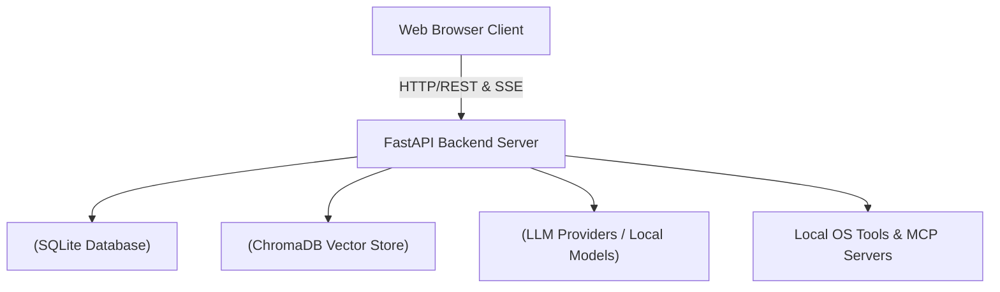

### Exhaustive System Architecture

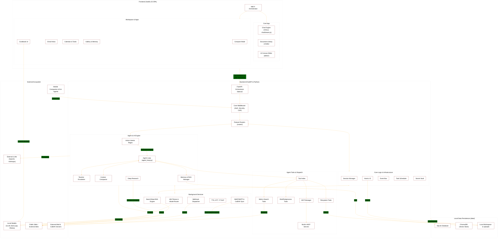

### Core Responsibilities
- **Frontend (Vanilla JS):** Manages user interactions, chat rendering, file attachments, state management, and real-time streaming updates.
- **Backend (FastAPI):** Orchestrates API routes, manages the database, executes agent loops and system tools, and interfaces with LLM providers or local models.
- **Cookbook & Hardware Fitness:** Analyzes the host's hardware (RAM, VRAM, GPU bandwidth) to recommend and manage local LLM serving (via `vLLM` or `llama.cpp`).
- **Memory & Storage:** Stores conversations, preferences, and calendars in SQLite, and maintains persistent semantic memory using ChromaDB.

## Frontend Architecture

### Frontend Architecture (Vanilla JS)

The frontend avoids heavy frameworks like React or Vue, opting for vanilla JavaScript ES modules. This choice keeps the application lightweight and reduces build complexity. It is centered around [`static/app.js`](../static/app.js) and [`static/js/`](../static/js/), tying together a decentralized but clean architecture.

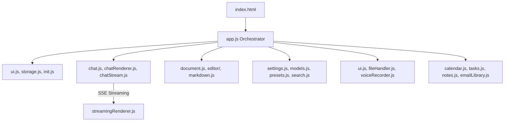

### Communication Pattern
The frontend communicates with the backend primarily through standard REST APIs. However, for chat generation and long-running tasks, it heavily relies on **Server-Sent Events (SSE)**.
- **Streaming:** When a chat is submitted, the frontend opens an SSE connection (`/api/chat_stream`). The backend streams chunks of markdown text, which the frontend renders incrementally.
- **Tool Progress:** While the backend agent loop is executing tools, it streams progress indicators to the frontend, which are displayed as "thinking" or "executing" animations.
- **Document Streaming:** Changes to documents are streamed via specific SSE event types (e.g., `doc_stream_open`, `doc_stream_delta`) and updated live in the editor panel.

---

### Frontend Realtime Streaming & Chat

The real-time conversational UI relies heavily on Server-Sent Events (SSE) to update the UI without dropping frames or blocking user input during long text generations.

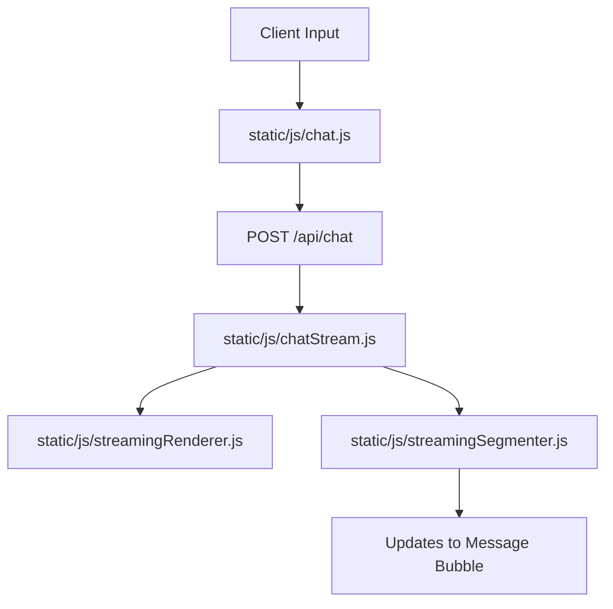

### Components
- **Chat Orchestrator ([`static/js/chat.js`](../static/js/chat.js) & [`chatRenderer.js`](../static/js/chatRenderer.js))**: The primary controller that captures user inputs, manages auto-scrolling, and delegates message rendering. It keeps the local message state in sync with the server response.
- **SSE Consumer ([`static/js/chatStream.js`](../static/js/chatStream.js))**: Opens the event stream and listens to JSON lines. It handles network disconnects, error codes, and maps raw text deltas into actionable state updates for the renderer.
- **Render Engine ([`static/js/streamingRenderer.js`](../static/js/streamingRenderer.js) & [`streamingSegmenter.js`](../static/js/streamingSegmenter.js))**: As tokens arrive sequentially, they are batched and flushed to the DOM. The segmenter handles complex boundary logic (e.g., detecting when a markdown code block ` ``` ` begins or ends) to ensure syntax highlighting is only applied once a block is complete, avoiding constant, CPU-heavy re-parsing of incomplete HTML.

---

### UI & UX Helpers

Small foundational pieces to support the frontend SPA.

### Purpose
Provide localization, theming, and consistent rendering mechanics.

### Compare Mode (Model Blind Testing)

Compare mode provides a dual-pane, blind AB testing interface to evaluate the quality of multiple AI models side-by-side on identical prompts.

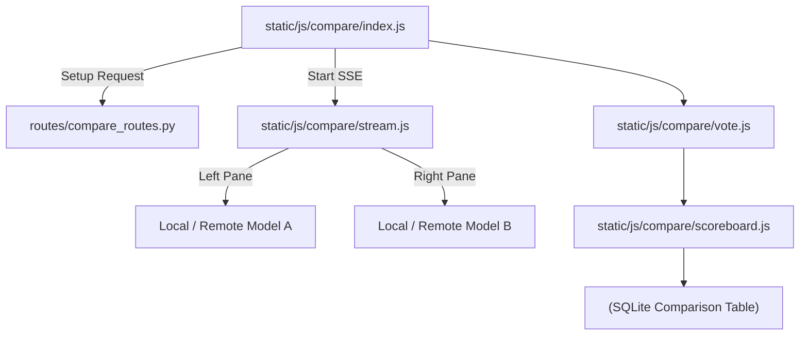

### Components
- **Frontend State ([`static/js/compare/`](../static/js/compare/))**: Comprises numerous modular files handling the dual UI ([`panes.js`](../static/js/compare/panes.js)), tracking connection health ([`probe.js`](../static/js/compare/probe.js)), and managing the synchronized SSE streams for both models ([`stream.js`](../static/js/compare/stream.js)). The models' identities remain obfuscated until a winner is declared ([`vote.js`](../static/js/compare/vote.js)). Additional components include [`icons.js`](../static/js/compare/icons.js), [`index.js`](../static/js/compare/index.js), [`models.js`](../static/js/compare/models.js), [`scoreboard.js`](../static/js/compare/scoreboard.js), [`selector.js`](../static/js/compare/selector.js), and [`state.js`](../static/js/compare/state.js).
- **Backend Routing ([`routes/compare_routes.py`](../routes/compare_routes.py))**: Manages the API surface area for starting a comparison, validating model access, handling vote submission, and managing the `RecordVoteRequest` schema to compile metrics over time.

---

### AI Canvas Editor Architecture

The rich image editor features a comprehensive, multi-layer HTML5 Canvas architecture integrated tightly with local backend AI operations.

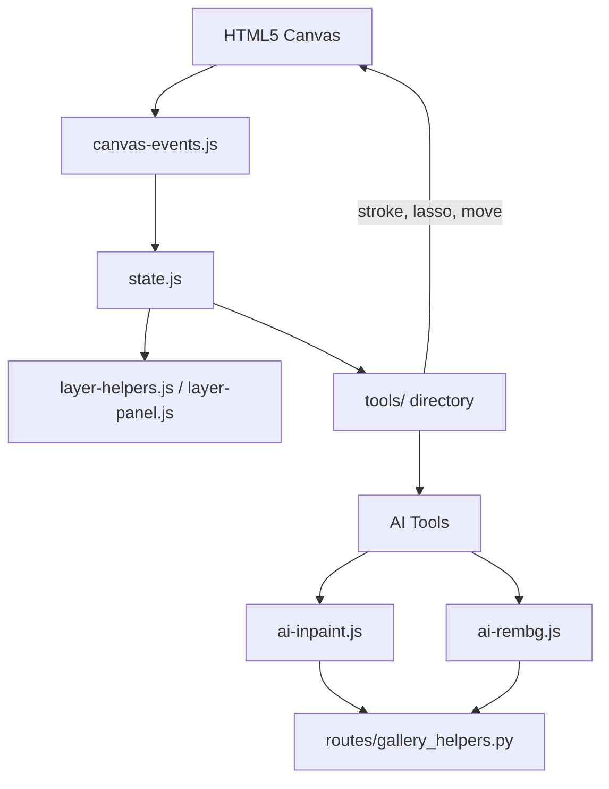

### Components
- **Core Canvas Logic ([`static/js/editor/`](../static/js/editor/))**: Managed by [`state.js`](../static/js/editor/state.js), with interactions translated through [`canvas-coords.js`](../static/js/editor/canvas-coords.js) and [`canvas-events.js`](../static/js/editor/canvas-events.js) to account for zooming and panning across the viewport. Additional state and rendering constraints are mapped via [`canvas-transforms.js`](../static/js/editor/canvas-transforms.js), [`checkerboard.js`](../static/js/editor/checkerboard.js), and [`snap.js`](../static/js/editor/snap.js). Shortcuts are managed via [`keyboard-shortcuts.js`](../static/js/editor/keyboard-shortcuts.js).
- **Tools & Effects**: Standard editing tools ([`tools/crop.js`](../static/js/editor/tools/crop.js), [`tools/flood-fill.js`](../static/js/editor/tools/flood-fill.js), [`tools/lasso-mask.js`](../static/js/editor/tools/lasso-mask.js), [`tools/lasso.js`](../static/js/editor/tools/lasso.js), [`tools/move.js`](../static/js/editor/tools/move.js), [`tools/stroke.js`](../static/js/editor/tools/stroke.js), [`tools/wand.js`](../static/js/editor/tools/wand.js), transform scripts like [`tools/transform-drag.js`](../static/js/editor/tools/transform-drag.js) / [`tools/transform-handles.js`](../static/js/editor/tools/transform-handles.js) / [`tools/transform-session.js`](../static/js/editor/tools/transform-session.js), and [`tools/clone.js`](../static/js/editor/tools/clone.js)) live in the [`tools/`](../static/js/editor/tools/) directory. Non-destructive overlays and visual filters reside in [`fx/`](../static/js/editor/fx/) (e.g., [`fx/adj-popup.js`](../static/js/editor/fx/adj-popup.js), [`fx/filter-string.js`](../static/js/editor/fx/filter-string.js), [`fx/histogram.js`](../static/js/editor/fx/histogram.js), [`fx/pixel-pass.js`](../static/js/editor/fx/pixel-pass.js)) and [`filters/`](../static/js/editor/filters/) (e.g., [`filters/blur.js`](../static/js/editor/filters/blur.js), [`filters/edge-feather.js`](../static/js/editor/filters/edge-feather.js)). Specialized operations like [`harmonize-masks.js`](../static/js/editor/harmonize-masks.js), [`composite-helpers.js`](../static/js/editor/composite-helpers.js), [`clipboard-and-drop.js`](../static/js/editor/clipboard-and-drop.js), and [`stroke-pipeline.js`](../static/js/editor/stroke-pipeline.js) support advanced composite workflows.
- **UI & Layout Controllers**: The editor interface is heavily modularized with floating panels, toolbars, and dynamic controls wrapped in the `wire-*.js` and `build/` files (e.g., [`wire-topbar.js`](../static/js/editor/wire-topbar.js), [`wire-topbar-menus.js`](../static/js/editor/wire-topbar-menus.js), [`wire-topbar-overflow.js`](../static/js/editor/wire-topbar-overflow.js), [`wire-selection-controls.js`](../static/js/editor/wire-selection-controls.js), [`wire-inpaint-controls.js`](../static/js/editor/wire-inpaint-controls.js), [`wire-import.js`](../static/js/editor/wire-import.js), [`wire-merge-buttons.js`](../static/js/editor/wire-merge-buttons.js), [`build/controls.js`](../static/js/editor/build/controls.js), [`build/popups.js`](../static/js/editor/build/popups.js), [`build/right-panel.js`](../static/js/editor/build/right-panel.js), [`build/toolbar.js`](../static/js/editor/build/toolbar.js), [`build/topbar.js`](../static/js/editor/build/topbar.js), [`build/transform-popup.js`](../static/js/editor/build/transform-popup.js)), driving components like the [`history-panel.js`](../static/js/editor/history-panel.js), [`layer-panel.js`](../static/js/editor/layer-panel.js), [`shortcuts-popover.js`](../static/js/editor/shortcuts-popover.js), [`stroke-tool-sliders.js`](../static/js/editor/stroke-tool-sliders.js), and specialized slider UX [`slider-ux.js`](../static/js/editor/slider-ux.js).
- **AI Integrations**: Specific files like [`ai-inpaint.js`](../static/js/editor/ai-inpaint.js), [`ai-rembg.js`](../static/js/editor/ai-rembg.js), [`ai-tools-misc.js`](../static/js/editor/ai-tools-misc.js), and [`ai-models.js`](../static/js/editor/ai-models.js) hook into the active canvas state to generate masks ([`mask-utils.js`](../static/js/editor/mask-utils.js)), transmit them to the backend, and apply the returned images onto new, non-destructive canvas layers ([`layer-helpers.js`](../static/js/editor/layer-helpers.js)). The actual tool API orchestration goes through [`ai-tool-runner.js`](../static/js/editor/ai-tool-runner.js).

## Backend & Core Services

### Backend Architecture & Routing (FastAPI)

The backend is built around a slim orchestrator ([`app.py`](../app.py)), which glues together several sub-modules. It uses **FastAPI** for route handling and **SQLAlchemy** for database interactions.

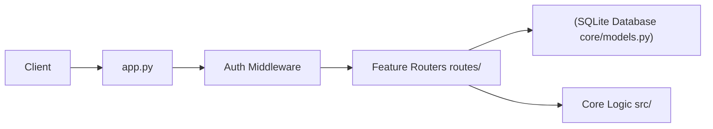

### API Routing & Controllers ([`routes/`](../routes/))

Odysseus isolates the API surface area from business logic through a highly modular router design. Instead of a monolithic routing file, the application features over 40 distinct route controllers in the [`routes/`](../routes/) directory.

### Core Utilities & Platform Mechanisms ([`core/`](../core/))

The core utilities manage foundational backend state, security, process infrastructure, and cross-platform mechanisms.

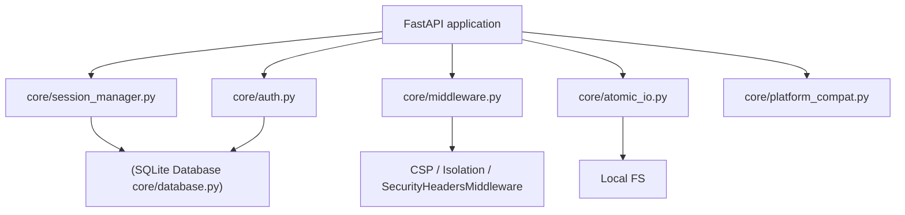

### Configuration & Data Models

Odysseus uses strict typing and configuration management to ensure payload integrity and environment consistency.

### Internal & Background Services ([`services/`](../services/))

The internal architecture separates discrete background jobs into standalone, stateless modules. These modules serve external integration requests triggered by the agent loop or via direct route access.

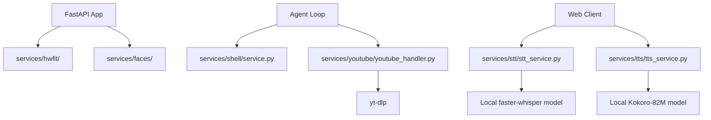

### Advanced Container Management ([`docker/`](../docker/))

The [`docker/`](../docker/) directory contains critical infrastructure for securely and reliably hosting Odysseus on Linux environments.

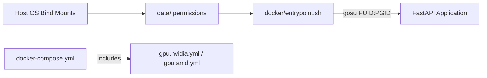

### Cookbook & System Utilities

A collection of operational scripts, setup hooks, and diagnostic endpoints.

### Purpose
To initialize the app predictably and provide developers insights into the running system.

## Agent & AI Orchestration

### Agent Orchestration, Tools & RAG

The Agent Loop is the brain of Odysseus, dynamically looping the LLM with local tools, semantic memory (RAG), and Teacher Escalation. It handles how the AI processes multi-step tasks.

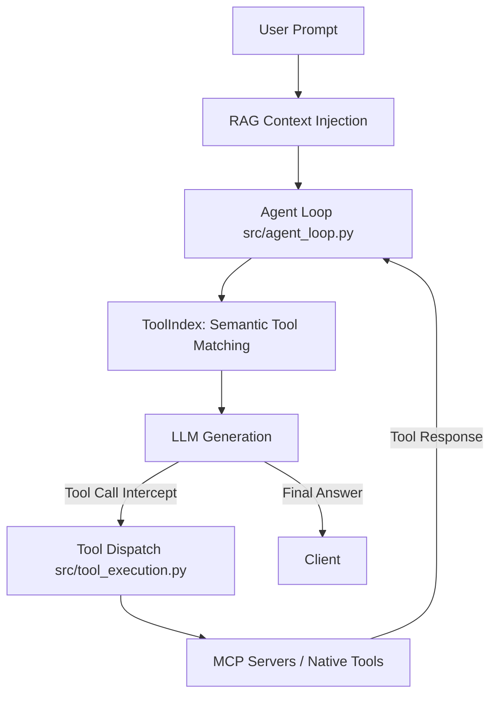

### The Agent Loop ([`src/agent_loop.py`](../src/agent_loop.py))
1. **Prompt Assembly:** The loop begins by gathering context: recent messages, available tools, system instructions, and RAG (Retrieval Augmented Generation) context.
2. **Tool Selection (RAG vs Fallback):**
   - Odysseus uses a `ToolIndex` ([`src/tool_index.py`](../src/tool_index.py)) to semantically match available tools to the user's query. This prevents overwhelming the LLM prompt with hundreds of tool schemas.
   - If RAG fails or is skipped, it falls back to a keyword-based heuristic.
3. **Execution Round:** The model generates a response. If the response contains tool calls (e.g., "search the web", "read a file"), the loop intercepts it.
4. **Tool Dispatch:** The backend maps the tool call to Python functions (defined in [`src/tool_implementations.py`](../src/tool_implementations.py) and mapped via [`src/tool_execution.py`](../src/tool_execution.py)) or MCP counterparts.
5. **Re-injection:** The results of the tool execution are appended to the conversation history as a "tool response" message.
6. **Recursion:** The loop iterates, sending the updated history back to the model until the model provides a final answer or hits a maximum round limit.

### Loop Breakers & Supervisors
- **Runaway Detector:** Identifies if a model is repeatedly calling the same tool with identical arguments without making progress, and breaks the loop.
- **Intent-without-action Supervisor:** Detects if a model says it will do something (e.g., "Let me check the logs") but fails to actually emit a tool call. It nudges the model to perform the action.
- **Completion Verifier:** A secondary, independent LLM evaluation pass that verifies if the requested task is genuinely complete before allowing the agent to end its turn.

### Teacher Escalation ([`src/teacher_escalation.py`](../src/teacher_escalation.py))
For self-hosted models that may struggle with complex tasks, Odysseus implements a "Teacher Escalation" mechanism.
1. If the student model fails (detected via regex on tool errors or "giving up" language), it pauses.
2. It sends the failing trace to a configured "Teacher" model (typically a stronger, cloud-based API like GPT-4o or Claude 3.5 Sonnet).
3. The Teacher explains how to solve the problem and creates a structured `SKILL.md` file.
4. This new skill is saved to the `SkillsManager`, empowering the student model to succeed on similar tasks.

### MCP & RAG Components
- **MCP Manager ([`src/mcp_manager.py`](../src/mcp_manager.py))**: Dynamically connects external Model Context Protocol servers via stdio/HTTP.
- **RAG & Memory ([`src/rag_manager.py`](../src/rag_manager.py), [`src/memory_vector.py`](../src/memory_vector.py))**: Vector store abstractions around ChromaDB using `fastembed` to index personal documents and memories.

---

### Chat Processing & Engine Logic ([`src/`](../src/))

The core execution of conversational AI interactions lives primarily in [`src/chat_processor.py`](../src/chat_processor.py), [`src/chat_handler.py`](../src/chat_handler.py), and [`src/agent_runs.py`](../src/agent_runs.py). These files form the glue bridging conversational memory with the underlying agent loop, assembling context objects, recording new learnings, and parsing complex documents inline.

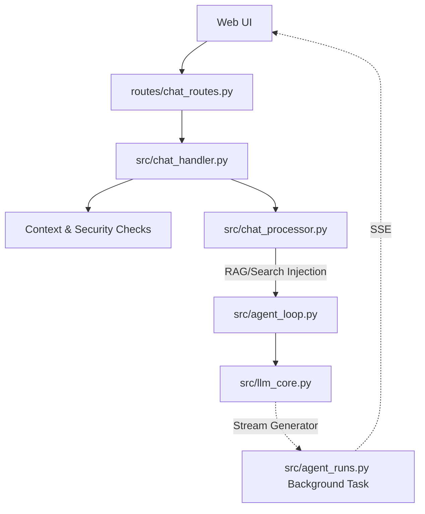

### Action Intents & Chat Routing ([`src/action_intents.py`](../src/action_intents.py))

Odysseus employs a lightweight routing heuristic to determine when a standard chat prompt should be promoted to full "agent mode" (invoking the agent loop and tools).

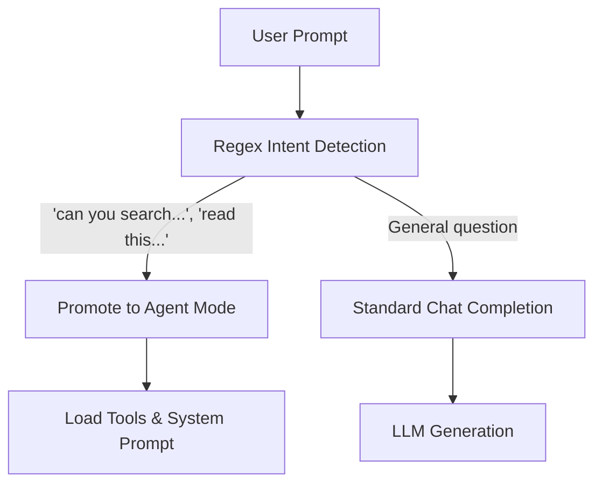

### Purpose
To avoid unnecessary LLM overhead and reduce latency/cost, the system uses deterministic regex patterns to detect when a user is explicitly asking the assistant to take an action (e.g., "can you search...", "please read this file...") rather than simply asking an informational question.

### Mechanics
- **`ToolIntent`**: A dataclass that evaluates `needs_tools`, `category`, and `reason`.
- **Patterns**: Scans for imperative verbs ("search", "read", "deploy"), modal questions ("can you", "would you"), UI/panel toggles, calendar lookups, and deep research invocations. It explicitly avoids triggering on explanatory questions (e.g., "how do I use grep?").
- **Outcome**: If an action intent is detected, the frontend is signaled or the backend automatically escalates the chat into the agent loop, loading the necessary tools and system prompts. This keeps general conversational chat fast and cheap, while reserving the heavy, multi-prompt `Agent Loop` strictly for tool-use workflows.

---

### Agent Tools Subsystem ([`src/agent_tools/`](../src/agent_tools/))

Odysseus provides its agent loop with a suite of highly privileged, local-first tools. These are organized functionally to limit scope and ensure secure execution.

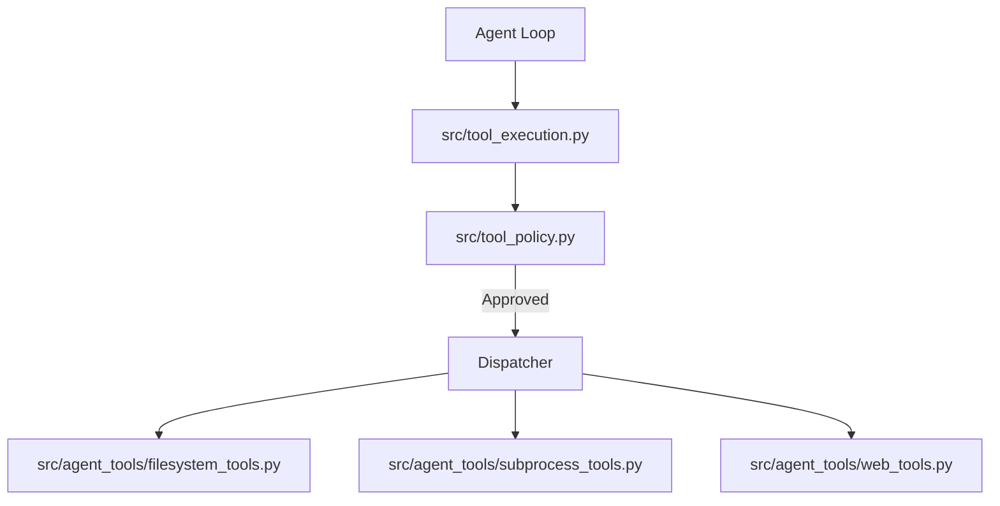

### Built-in Actions & Scheduled Tasks ([`src/builtin_actions.py`](../src/builtin_actions.py))

Odysseus contains a registry of native automation actions executed periodically by the task scheduler.

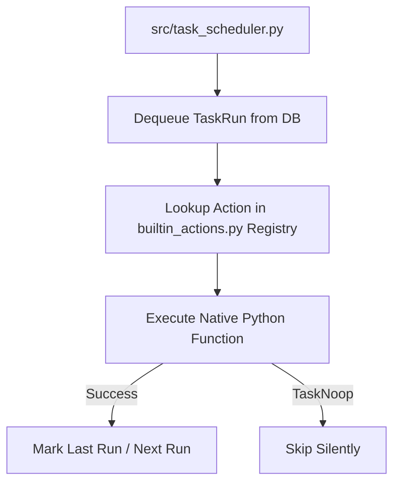

### Purpose
Provides reliable, zero-cost execution for routine system maintenance and user-defined scheduled tasks.

### Mechanics
- **Registry**: Houses predefined python functions mapped to string identifiers (e.g., `system.tidy_calendar`, `system.poll_email`).
- **`TaskNoop` Exception**: A silent exception used by actions to indicate there was nothing to do (e.g., no new emails, calendar already synced), preventing log spam.
- **Execution**: The scheduler ([`src/task_scheduler.py`](../src/task_scheduler.py)) dequeues pending tasks from the database and invokes the corresponding function in [`builtin_actions.py`](../src/builtin_actions.py).

## Data, Memory & RAG

### Data, Memory, and Storage

All data is kept local within the `data/` directory, adhering to the project's privacy-first ethos.

### ChromaDB (Vector Store)
- **Semantic Memory:** Odysseus uses `ChromaDB` and ONNX `fastembed` for vector similarity search.
- **`MemoryManager` ([`src/memory.py`](../src/memory.py)):** Extracts and stores long-term facts, preferences, and contacts. It uses hybrid search (Jaccard similarity + semantic keyword boosting) to inject relevant memories into the agent's context.

### SkillsManager
- Manages `SKILL.md` files representing procedures.
- Published skills and teacher-escalation drafts are injected into the agent prompt based on relevance to the current conversation.

---

### Model Configuration & RAG Core

The system interfaces with multiple LLM backends while maintaining a persistent RAG index.

### Purpose
Provides a unified layer to interact with LLMs and Vector Embeddings, hiding the implementation specifics from the main Agent Loop.

### Advanced Memory & Skills Pipeline

Long-term semantic context goes beyond just storing facts; the system contains a dedicated pipeline for discovering, extracting, and importing structured "Skills".

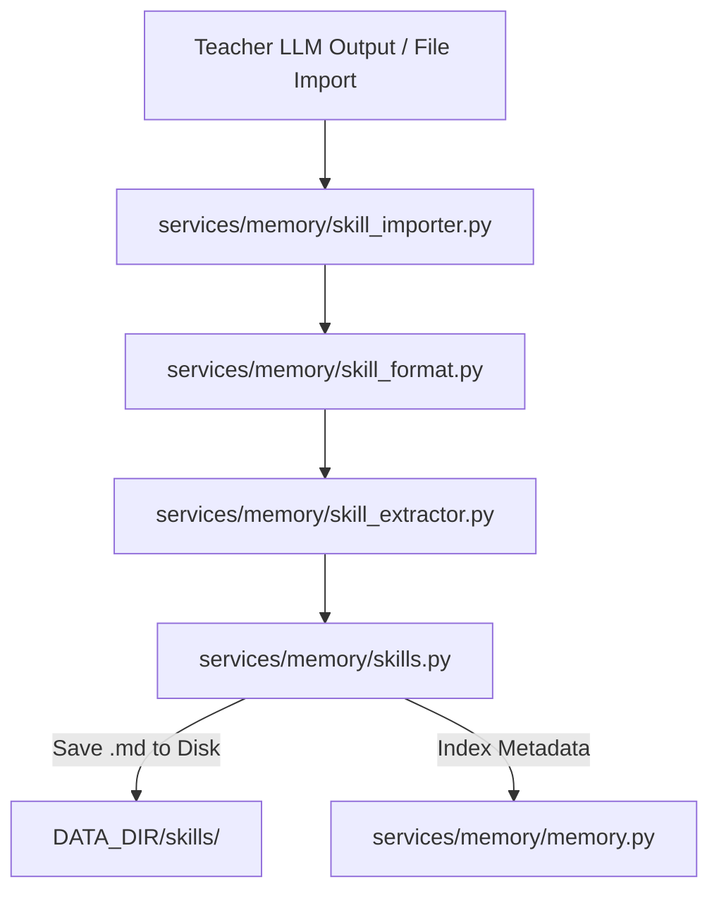

### Components
- **Skill Extraction ([`services/memory/skill_extractor.py`](../services/memory/skill_extractor.py), [`services/memory/memory_extractor.py`](../services/memory/memory_extractor.py))**: Uses intelligent parsing to derive structured procedure steps and preconditions from freeform conversation text or teacher model outputs. The generic `memory_extractor.py` handles parsing generic life facts and preferences.
- **Skill Formatting ([`services/memory/skill_format.py`](../services/memory/skill_format.py))**: Ensures that every skill strictly adheres to the markdown specifications required for the Agent loop to parse it effectively (e.g., maintaining `SKILL.md` boundaries).
- **Skill Importer ([`services/memory/skill_importer.py`](../services/memory/skill_importer.py))**: Handles the ingest of external skill packs (like those from the integrations folder), safely validating content without trusting external metadata completely.
- **Manager ([`services/memory/skills.py`](../services/memory/skills.py))**: The central service that orchestrates reading and writing skills to the local disk and synchronizing them with the Vector Database for semantic retrieval later.

## Features & Integrations

### External Integrations & Companion Bridge

Odysseus can pair with companion apps, securely bridge third-party AI agents, and dispatch external webhooks.
- **Companion Bridge API ([`companion/README.md`](../companion/README.md))**: Detailed API routes and setup instructions for the mobile bridge.
- **Claude Code Integration ([`integrations/claude/`](../integrations/claude/))**: A skill bundle enabling Anthropic's Claude Code CLI to connect to the scoped Odysseus API. Includes a setup guide ([`README.md`](../integrations/claude/README.md)) and the skill definition ([`SKILL.md`](../integrations/claude/skills/odysseus/SKILL.md)).
- **Codex Integration ([`integrations/codex/`](../integrations/codex/))**: A plugin enabling the Codex Agent to interact with Odysseus data. Contains its setup guide ([`README.md`](../integrations/codex/README.md)), plugin manifest ([`plugin.json`](../integrations/codex/.codex-plugin/plugin.json)), and skill definition ([`SKILL.md`](../integrations/codex/skills/odysseus/SKILL.md)).


### Components
- **Companion Bridge ([`companion/pairing.py`](../companion/pairing.py), [`companion/routes.py`](../companion/routes.py), [`companion/__init__.py`](../companion/__init__.py))**: Manages secure pairing using tokens and QR codes, allowing mobile or external apps to interact with the API securely without duplicating core LLM logic. Endpoints like `/api/companion/info` allow discovery, while token minting enforces strict CSRF protections.
- **Webhook Manager ([`src/webhook_manager.py`](../src/webhook_manager.py))**: Dispatches system events out to configured webhooks securely, filtering out private IP loopbacks.
- **External API Integrations ([`src/integrations.py`](../src/integrations.py))**: A generalized module to store and resolve API keys, OAuth tokens, and connection configs for external tools.
- **The "Codex" Abstraction ([`routes/codex_routes.py`](../routes/codex_routes.py))**: Historically named "codex", this router exposes the canonical, scope-gated API endpoints (`/api/codex/*`) that external agents (like Claude Code) hit to list available tools and execute them. Plugins reside in [`integrations/claude/`](../integrations/claude/) and utilize Python glue scripts like [`integrations/claude/skills/odysseus/scripts/odysseus_api.py`](../integrations/claude/skills/odysseus/scripts/odysseus_api.py) and [`integrations/codex/scripts/odysseus_api.py`](../integrations/codex/scripts/odysseus_api.py) to securely relay tool calls to the backend. API tokens are strictly scoped.
- **YouTube Handler ([`src/youtube_handler.py`](../src/youtube_handler.py))**: Provides core YouTube video interaction capabilities, transcript fetching, and metadata extraction.

---

### MCP Extensibility & Built-in Servers

The system natively supports adding extensions via the Model Context Protocol (MCP), registering native functionalities, and supporting third-party subscriptions.

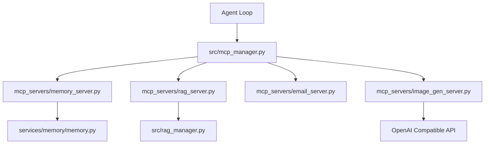

### Purpose
To leverage existing Copilot subscriptions, register built-in tools like memory or email cleanly into the prompt, and allow dynamic loading of tools that aren't natively compiled into the Python source.

### Deep Research ([`src/deep_research.py`](../src/deep_research.py))

Implements an iterative loop for complex web searching, summarization, and extracting topic intent.

---

### Email & CalDAV Integration

- **Email:** Built-in IMAP/SMTP triage. It can summarize, auto-tag, and draft replies using AI.
- **CalDAV:** Local-first calendar synchronization with external providers (Radicale, Nextcloud, Apple, Fastmail).

## Core Systems (Search, Auth, Files)

### Security, Authentication & User Management

Odysseus treats the self-hosted environment like an admin console due to powerful local tools (shell, file IO). It uses a combination of route handling and helper logic to manage access control.

### Purpose
To authenticate incoming requests, issue and validate tokens, protect routes, and provide device-flow authorization when needed. The trust boundary is established for trusted users on a private network, and the goal is to prevent unauthenticated access or privilege escalation.

### Components
- **AuthManager & Routing ([`core/auth.py`](../core/auth.py), [`routes/auth_routes.py`](../routes/auth_routes.py), [`src/auth_helpers.py`](../src/auth_helpers.py)):** Handles bcrypt-hashed passwords, session cookies, and user login logic. Enabled by `AUTH_ENABLED=true`. Generates JWT tokens and authenticates against the user database. Includes built-in Time-based One-Time Password (TOTP) 2FA logic.
- **API Tokens ([`src/api_key_manager.py`](../src/api_key_manager.py)):** Supports Bearer token authentication for external integrations (like Webhooks or Zapier). Tokens are cached for performance and invalidated on change.
- **Security Middleware:** `SecurityHeadersMiddleware` enforces safe browser headers. `AuthMiddleware` protects routes and validates proxy/tunnel forwarding headers to prevent auth bypass.
- **Device Flow ([`routes/device_flow.py`](../routes/device_flow.py)):** Facilitates the OAuth 2.0 Device Authorization Grant, allowing head-less devices to securely pair.

---

### Vault & Secret Storage ([`src/secret_storage.py`](../src/secret_storage.py), [`routes/vault_routes.py`](../routes/vault_routes.py))

Odysseus provides an encrypted secret store, safeguarding credentials while ensuring usability.

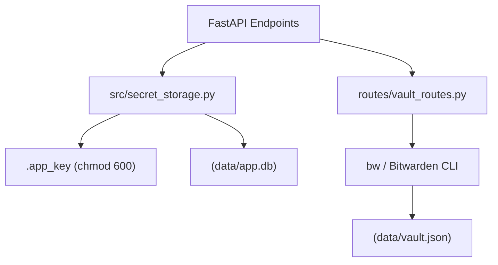

### Components
- **Secret Storage ([`src/secret_storage.py`](../src/secret_storage.py))**: A Fernet-based symmetric encryption module. It generates an `.app_key` (secured with `0o600` permissions) to encrypt sensitive configuration data, such as IMAP/SMTP passwords, before storing them in the SQLite database. Encrypted rows are prepended with `enc:` to seamlessly handle unencrypted legacy values.
- **Vault Integration ([`routes/vault_routes.py`](../routes/vault_routes.py))**: A wrapper around the `bw` (Bitwarden / Vaultwarden) CLI. It allows admins to unlock their vault, caching the session token in `data/vault.json`. Passwords are deliberately passed via `stdin` rather than command-line arguments to prevent leakage into `ps` or `/proc/<pid>/cmdline`.

---

### Threat Model & Prompt Security ([`THREAT_MODEL.md`](../THREAT_MODEL.md), [`src/prompt_security.py`](../src/prompt_security.py))

Managing the interaction between the system, the LLM, and external data is critical for both utility and safety. Odysseus acknowledges its nature as a privileged admin console.

### Key Tenets
1. **Admin Isolation**: Admins have full access to high-risk tools (shell, files, MCP, model serving, email, etc.). Non-admin users are strictly segregated to safe capabilities (chat, web search, memory) and cannot execute commands or read arbitrary files.
2. **Internal Tool Loopback**: The agent loop talks back to the API over a secured in-process HTTP loopback. At startup, the `core/middleware.py` generates a random, non-persisted `INTERNAL_TOOL_TOKEN`. HTTP requests carrying this token, or flagged with a reserved `internal-tool` user, are implicitly granted access.
3. **No Network Egress Sandbox**: Tools executed by the LLM run directly as the app process user. A successful prompt-injection attack that escapes the prompt security wrapper could execute shell commands, but only if the user is an admin.

### Components
- **Preset Manager ([`src/preset_manager.py`](../src/preset_manager.py))**: Maintains predefined system prompts, temperature configurations, and max token limits (`Code Analyze`, `Brainstorm`, `Reason`) as well as user-created templates. It performs atomic, concurrent-safe writes to `data/presets.json`.
- **Prompt Security ([`src/prompt_security.py`](../src/prompt_security.py))**: Defends against prompt-injection attacks. Any text originating from a potentially untrusted source (emails, web results, external URLs) is sandboxed inside a `<<<UNTRUSTED_SOURCE_DATA>>>` boundary. The wrapper instructs the LLM strictly to treat the encapsulated content as data rather than executable instructions, preventing malicious documents from co-opting the agent.

---

### Search Provider & Ranking Engine

Odysseus implements a modular and extensible search abstraction tier, allowing swapping of underlying search providers while maintaining unified output format and caching.

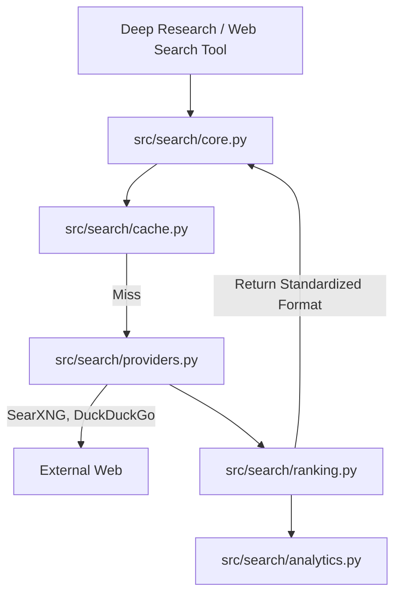

### Deep Research & Topic Analysis

Deep Research allows multi-step, autonomous information gathering resulting in a visually appealing HTML report. It facilitates complex web searching, summarization, and extracting topic intent from queries.

```mermaid
graph TD
    Query["Research Prompt"] --> Plan["LLM Planning"]
    Plan --> Gen["Generate Sub-Queries"]
    Gen --> Search["Search via SearXNG"]
    Search --> Fetch["Fetch & Extract URL Content"]
    Fetch --> Synthesize["Synthesize Findings"]
    Synthesize --> |Iterate if needed| Gen
    Synthesize --> Final["Generate Final Report"]
    Final --> Visual["visual_report.py HTML Render"]
```

### Components
- **Deep Researcher ([`src/deep_research.py`](../src/deep_research.py))**: The orchestration class. Implements an iterative think-search-extract-synthesize loop.
- **Research API & Handlers ([`routes/research_routes.py`](../routes/research_routes.py), [`src/research_handler.py`](../src/research_handler.py))**: Manages the API surface and underlying orchestration to spin off long-running deep research loops.
- **Search Utilities ([`src/research_utils.py`](../src/research_utils.py), [`routes/search_routes.py`](../routes/search_routes.py))**: Utilities for parsing web scrape data and routes to interface with SearXNG backends for general querying.
- **Visual Report ([`src/visual_report.py`](../src/visual_report.py))**: Transforms the synthesized markdown report and JSON sources into a self-contained, themed HTML file with a table of contents and inline references.
- **Topic Analysis ([`src/topic_analyzer.py`](../src/topic_analyzer.py), [`src/goal_based_extractor.py`](../src/goal_based_extractor.py))**: Analyzes the generated content dynamically to form a structured summary or determine if the research goal has been met.

## Workspace & Apps

### Document & Workspace Logic

Odysseus supports an AI-assisted rich text and markdown editor.

### Components
- **[`src/document_processor.py`](../src/document_processor.py):** Determines if a document is code, text, or binary. Applies syntax formatting to specific extensions and prepares text to be manipulated by the LLM.
- **[`src/document_actions.py`](../src/document_actions.py):** Contains functions that process AI commands on documents (like inpainting, summarization, or translation) directly on the document body.
- **Document Editor Streaming:** Much like chat, document updates are streamed live to the UI via Server-Sent Events, ensuring that AI transformations (or collaborative sync updates) are rendered immediately in the markdown editor without requiring full page reloads. This relies heavily on invariants tested by the Node.js suite inside [`tests/streaming/`](../tests/streaming/).

---

### Personal & Workspace Data

This module handles isolated user contexts such as personal settings, contacts, and workspace-specific document storage.

### Purpose
To ensure multi-tenancy and data isolation where users only interact with their configured environment.

### Tasks, Background Jobs & Notes

Odysseus implements a built-in scheduler to manage long-running operations and recurring events natively.

### Components
- **[`src/task_scheduler.py`](../src/task_scheduler.py):** An asynchronous scheduler managing `ScheduledTask` entries from the database. It handles deduplication of API fetches with a TTL cache (`_shared_cache`) for simultaneous triggers and executes recurring tasks reliably.
- **[`src/bg_jobs.py`](../src/bg_jobs.py):** Runs heavy operations (like `ffmpeg`, model downloads, package installations via the `bash` tool) in a detached process. The agent writes exit-code status files rather than relying on live PIDs, guaranteeing survival across server restarts.
- **[`src/task_endpoint.py`](../src/task_endpoint.py) / [`src/note_routes.py`](../routes/note_routes.py):** Expose endpoints for creating quick-capture notes, to-do lists, and scheduled actions that the system acts on periodically.

---

### File Uploads & Document Parsers

To extract and interpret user data natively, Odysseus incorporates several parsing strategies.

### Components
- **[`src/upload_handler.py`](../src/upload_handler.py):** Governs file ingests. It standardizes sanitization (`secure_filename`), applies environment-defined limits ([`upload_limits.py`](../src/upload_limits.py)), and moves the artifacts to `DATA_DIR/uploads`.
- **PDF Infrastructure ([`src/pdf_runtime.py`](../src/pdf_runtime.py), [`src/pdf_forms.py`](../src/pdf_forms.py), [`src/pdf_form_doc.py`](../src/pdf_form_doc.py))**:
  - Uses `PyMuPDF` (when optionally installed) for robust PDF handling.
  - Extracts text and parses fillable AcroForm fields.
  - Features dynamic HTML-comment and markdown generation (`pdf_form_doc.py`) to turn a visual PDF form into an editable markdown document, preserving the hidden widget metadata in sidecar files.
  - Provides advanced abilities like stamping user-drawn signature PNGs or text directly onto exact X/Y coordinates over a PDF page.
- **Office Document Parsing ([`src/markitdown_runtime.py`](../src/markitdown_runtime.py)):** Provides extraction for proprietary office formats (`.docx`, `.xlsx`, `.pptx`) using the `markitdown` tool, converting complex structural elements into flat Markdown suitable for the LLM context window.

---

### Gallery & Media Editing

Odysseus includes an AI-integrated gallery and media editor.

### Components
- **Gallery Routes ([`routes/gallery_routes.py`](../routes/gallery_routes.py))**: Exposes REST endpoints to query, filter, and upload images. All queries are heavily owner-scoped to ensure strict tenant isolation.
- **Frontend State ([`static/js/gallery.js`](../static/js/gallery.js), [`static/js/galleryEditor.js`](../static/js/galleryEditor.js))**: Manages the multi-select interface, tag filtering, album sorting, and dynamic grid rendering, alongside routing into the standalone image editor.
- **AI Editor ([`static/js/editor/`](../static/js/editor/))**: A complex, multi-layered HTML5 canvas application. Features include checkerboard backgrounds, mask creation tools ([`wand.js`](../static/js/editor/tools/wand.js), [`lasso.js`](../static/js/editor/tools/lasso.js)), image composition ([`clone.js`](../static/js/editor/tools/clone.js)), and direct hooks to the backend for AI-assisted operations like inpainting or background removal ([`ai-inpaint.js`](../static/js/editor/ai-inpaint.js), [`ai-rembg.js`](../static/js/editor/ai-rembg.js)).

---

### Session & History Management

A core feature of the agent UI is managing conversational sessions and historical context over time.

### Purpose
To persist user chats across reloads, prune stale data, and provide search functionalities over past conversations.

### Context Compaction ([`src/context_compactor.py`](../src/context_compactor.py))

To prevent the LLM context window from overflowing during long sessions, Odysseus implements an automatic context compaction mechanism.

```mermaid
graph TD
    History["Conversation History"] --> Check["Estimate Token Count"]
    Check --> |Exceeds Threshold| Isolate["Isolate Oldest Messages"]
    Isolate --> Summarize["LLM Summarization Call"]
    Summarize --> DBUpdate["Replace Messages with Summary System Message"]
    DBUpdate --> NewHistory["Compacted Conversation History"]
    Check --> |Within Threshold| Proceed["Continue Normally"]
```

### Purpose
It ensures that long-running conversations do not crash due to token limits while preserving essential context and historical facts.

### Mechanics
- **Token Estimation**: Monitors the token count of the conversation history.
- **Compaction Trigger**: When the context approaches a predefined limit, it isolates the oldest messages.
- **Summarization**: It uses a fast LLM call (often a smaller model or the current one) to generate a dense summary of the oldest interactions.
- **State Update**: Replaces the summarized block in the SQLite database with a single "system" message containing the summary, significantly reducing token usage while maintaining narrative continuity.

---

### Email & Calendar Sync

Odysseus features robust, local-first syncing for emails (IMAP/SMTP) and calendars (CalDAV).

```mermaid
graph TD
    ExtCal["External CalDAV Server"] <--> Sync["caldav_sync.py"]
    ExtMail["IMAP / SMTP Server"] <--> MailPoll["email_pollers.py"]
    Sync <--> DB["(SQLite Local Cache)"]
    MailPoll <--> DB
    MailPoll --> Parser["email_thread_parser.py"]
    MailPoll --> LLM["Auto Summarize & Classify"]
```

### Components
- **CalDAV Sync ([`src/caldav_sync.py`](../src/caldav_sync.py), [`src/caldav_writeback.py`](../src/caldav_writeback.py))**: Resolves CalDAV hosts, fetches `.ics` events, caches them locally, and pushes local edits back to the remote server.
- **Email Pollers ([`routes/email_pollers.py`](../routes/email_pollers.py))**: Background threads that poll IMAP folders, detect new mail, and run background LLM tasks to summarize, tag, or auto-reply.
- **Thread Parser ([`src/email_thread_parser.py`](../src/email_thread_parser.py))**: An advanced HTML/plaintext parser that strips quotes, mashes headers, and normalizes email body contents for LLM consumption.
- **Frontend Mail UI ([`static/js/emailInbox.js`](../static/js/emailInbox.js), [`static/js/emailLibrary/state.js`](../static/js/emailLibrary/state.js), [`static/js/emailLibrary/utils.js`](../static/js/emailLibrary/utils.js))**: Responsible for the email inbox view, state management of selected threads, and formatting tools.

---

### Cookbook & Hardware Fitness

The "Cookbook" automatically analyzes host hardware to recommend, download, and serve models.

```mermaid
graph LR
    OS["OS / sysfs / WMI"] --> HW["Hardware Discovery hardware.py"]
    HW --> Fit["Fitness Scoring fit.py"]
    Fit --> Serve["Model Serving cookbook_serve_lifecycle.py"]
    Serve --> Engine["vLLM / llama.cpp / tmux"]
```

### Components
- **Hardware Discovery ([`services/hwfit/hardware.py`](../services/hwfit/hardware.py))**: Reads `/sys/class/drm`, `nvidia-smi`, or Windows WMI to accurately gauge CPU, RAM, GPU architectures, and VRAM availability.
- **Fitness Scoring & Routing ([`services/hwfit/fit.py`](../services/hwfit/fit.py))**:
  - Computes a dynamic `_fit_score` based on required vs. available VRAM and context window parameters.
  - `image_models.py` and `profiles.py` provide specific tuning constraints and known parameter bounds for stable diffusion and language model variants.
  - Manages quantization formats (e.g., distinguishing between GGUF for llama.cpp vs AWQ/FP8 for vLLM).
  - Explicitly restricts consumer AMD hardware (RDNA) and Apple Silicon platforms to GGUF formats to ensure compatibility, hiding models that won't run locally.
- **Serve Lifecycle ([`src/cookbook_serve_lifecycle.py`](../src/cookbook_serve_lifecycle.py))**: Orchestrates the downloading and serving of models via `tmux` sessions, hooking directly into local inference engines like vLLM or Ollama.

---

### Cookbook UI State Machine

The local model manager ("Cookbook") features a robust client-side state machine capable of tracking detached background processes safely across browser refreshes.

```mermaid
graph TD
    User[Client] --> CookbookUI["cookbook.js"]
    CookbookUI --> Diagnosis["cookbook-diagnosis.js"]
    CookbookUI --> HWFit["cookbook-hwfit.js"]
    HWFit --> |Fetch Metrics| HWAPI["routes/hwfit_routes.py"]
    CookbookUI --> Actions["Download / Serve"]
    Actions --> Download["cookbookDownload.js"]
    Actions --> Serve["cookbookServe.js"]
    Download --> |SSE Tracking| Signal["cookbookProgressSignal.js"]
    Serve --> Running["cookbookRunning.js"]
```

### Components
- **Core Wrapper ([`static/js/cookbook.js`](../static/js/cookbook.js))**: Main orchestrator for cookbook UI integration.
- **UI Diagnostics ([`static/js/cookbook-diagnosis.js`](../static/js/cookbook-diagnosis.js))**: Polling mechanisms to verify if background processes like `ollama` or `vllm` are accessible before allowing operations.
- **Hardware Fitness Client ([`static/js/cookbook-hwfit.js`](../static/js/cookbook-hwfit.js))**: Renders the visual bars for required VRAM and Context Window budgeting based on the data provided by the backend's [`fit.py`](../services/hwfit/fit.py) via [`hwfit_routes.py`](../routes/hwfit_routes.py).
- **Process Signals ([`static/js/cookbookProgressSignal.js`](../static/js/cookbookProgressSignal.js), [`static/js/cookbookDownload.js`](../static/js/cookbookDownload.js), [`static/js/cookbookServe.js`](../static/js/cookbookServe.js), [`static/js/cookbookRunning.js`](../static/js/cookbookRunning.js), [`static/js/cookbookSchedule.js`](../static/js/cookbookSchedule.js))**: Tracks asynchronous SSE streams for model downloads and serving execution. If the browser tab is closed during a download, the next time the Cookbook is opened, [`cookbookRunning.js`](../static/js/cookbookRunning.js) attempts to reconnect and parse the active system state to restore the progress bar seamlessly.

---

### Tooling, Execution & Security

Odysseus dynamically gives tools to the LLMs, requiring strict security boundaries.

### Purpose
To execute code and filesystem tools securely while protecting the host machine from rogue LLM behavior.

### Multimedia & Background Tasks

The system handles more than just text generation, acting as an ambient AI workspace.

### Purpose
To handle audio processing (TTS/STT), gallery imaging, background scheduling, and calendar synchronization.

## Infrastructure, Ops & Testing

### Deployment, Hardware Discovery & Background Jobs

Odysseus is designed to run anywhere, but Docker is recommended. It employs standard and GPU-accelerated Docker builds along with native OS scripts.

### Hardware Discovery ([`services/hwfit/`](../services/hwfit/))
The `hwfit` module analyzes the host machine (RAM, VRAM, GPU bandwidth) to score HuggingFace models. Models fitting entirely in VRAM are prioritized.

### Deployment Models & Launchers
- **Docker Compose:** The default setup runs Odysseus alongside ChromaDB and SearXNG, orchestrated by [`docker-compose.yml`](../docker-compose.yml).
- **Docker Entrypoints ([`docker/entrypoint.sh`](../docker/entrypoint.sh))**: Runs PUID/PGID matching to ensure bind-mounted volumes don't suffer from root-ownership permission issues.
- **GPU Passthrough:** Special overlays ([`docker-compose.gpu-nvidia.yml`](../docker-compose.gpu-nvidia.yml), [`docker-compose.gpu-amd.yml`](../docker-compose.gpu-amd.yml)) configure NVIDIA or AMD ROCm passthrough.
- **Native Launchers ([`launch-windows.ps1`](../launch-windows.ps1), [`start-macos.sh`](../start-macos.sh))**: Automate Venv creation, dependency installation, and server binding on native OSes. Additionally, [`update_windows.bat`](../update_windows.bat) helps keep Windows installations up to date, and [`build-macos-app.sh`](../build-macos-app.sh) packages the application for macOS. [`install-service.sh`](../install-service.sh) sets up the systemd service on Linux.
- **Local Serving Engine:** The "Cookbook" dynamically installs and configures `vLLM` or `llama.cpp` in the local data directory, orchestrating inference via `tmux` sessions.

### Task Scheduler & Background Jobs
- **Task Scheduler ([`src/task_scheduler.py`](../src/task_scheduler.py), [`src/bg_jobs.py`](../src/bg_jobs.py))**: Background loops that execute delayed actions, background research runs, ping reminders, and cron-scheduled tasks.

---

### Event Bus & Application Readiness

Odysseus incorporates a lightweight, in-memory event bus to trigger automated jobs without relying on heavyweight external message brokers (like Redis or RabbitMQ).

```mermaid
graph TD
    System["Application Events"] --> |fire_event| Bus["src/event_bus.py"]
    Bus --> |Loop create_task| Handler[_handle_event]
    Handler --> |If threshold met| Scheduler["src/task_scheduler.py"]
    Scheduler --> DB["(SQLite ScheduledTasks)"]
```

### Components
- **Event Bus ([`src/event_bus.py`](../src/event_bus.py))**: Provides a decoupled way to fire events (e.g., `session.created`, `message.sent`). It manages in-memory counters and triggers specific tasks via the scheduler when thresholds are crossed.
- **Readiness Probes ([`src/readiness.py`](../src/readiness.py), [`src/service_health.py`](../src/service_health.py))**: Implements strict `GET /api/ready` logic. Beyond simple liveness, it executes real SQL (`SELECT 1`) to ensure the DB connection pool is functional, and tests write permissions to the `DATA_DIR`. The `service_health.py` module orchestrates deep diagnostic polling for external email servers, webhook receivers, and model APIs under strict timeouts.
- **Rate Limiter ([`src/rate_limiter.py`](../src/rate_limiter.py))**: Uses an in-memory sliding window algorithm to throttle abuse of endpoints (e.g., token minting or login attempts) before the requests reach the deeper application logic.

---

### Outgoing Webhooks ([`src/webhook_manager.py`](../src/webhook_manager.py))

Odysseus can dispatch system events to external HTTP endpoints, allowing automation platforms like ntfy, Zapier, or custom scripts to react to chat completions and new sessions.

```mermaid
graph TD
    EventBus["Event Bus / Agent Loop"] --> |session.created, chat.completed| Manager["src/webhook_manager.py"]
    Manager --> |Lookup Subscriptions| DB["(SQLite Webhooks)"]
    Manager --> |Validate URL| SSRF["SSRF Security Layer"]
    SSRF --> |Block Private IP| Drop[Discard]
    SSRF --> |Permit| Dispatch["HTTPX Async POST"]
    Dispatch --> |X-Odysseus-Signature| External["External Webhook URL"]
```

### Components & Security
- **Event Dispatch**: Monitored events trigger `webhook_manager.dispatch(event_type, payload)` asynchronously in the background.
- **SSRF Protection (`_PRIVATE_NETWORKS`)**: To prevent Server-Side Request Forgery, where a user configures a webhook to attack internal infrastructure (e.g., querying `127.0.0.1` or `10.0.x.x`), the webhook manager strictly resolves target domains and drops requests bound for private, loopback, or link-local subnets.
- **Signature Validation**: Outgoing requests include an `X-Odysseus-Signature` header computed via HMAC-SHA256, allowing external recipients to verify that the webhook legitimately originated from Odysseus and hasn't been tampered with.

---

### Configuration & Third-party Services ([`config/`](../config/), [`licenses/`](../licenses/))

Odysseus relies on several external components and strictly manages their configuration.

### Operational CLI Scripts ([`scripts/`](../scripts/))

For maintenance, debugging, and offline operations, Odysseus includes a suite of Python CLI tools.

### CI/CD, Build, and Repository Management

Odysseus utilizes standard tools for Python/Node environments, augmented by strict GitHub Actions workflows to maintain code quality.

### Testing Taxonomy & Tooling ([`tests/`](../tests/), [`scripts/`](../scripts/))

Odysseus enforces a strict, deterministic testing strategy designed to eliminate order-dependence and global state leakage. A robust local environment requires automated regression assurance and operations tooling.

```mermaid
graph TD
    TestRunner["Pytest Runner"] --> Collection["conftest.py / _taxonomy.py"]
    Collection --> Tags["Taxonomy Area Tags"]
    Tags --> Unit["tests/ unit / helpers"]
    Tags --> Routes["tests/ routes integration"]
    Tags --> Services["tests/ services / background"]
    Tags --> Security["tests/ security / isolation"]
    TestRunnerNode["Node.js Runner"] --> JS["tests/ streaming/*.mjs"]
    Unit -.-> |Import State Isolation| Module["Core Modules"]
    JS --> Segmenter["static/js/streamingSegmenter.js"]
    CLI["scripts/_lib/cli.py"] --> OdyScripts["scripts/odysseus-*"]
    OdyScripts --> Core["Core Python Application"]
```

## Detailed File Repository
This section provides an exhaustive list of the files that make up the system architecture, organized by their domain.

### Frontend Files
- [`static/app.js`](../static/app.js), [`static/fonts/FiraCode-Light.woff2`](../static/fonts/FiraCode-Light.woff2), [`static/fonts/FiraCode-Regular.woff2`](../static/fonts/FiraCode-Regular.woff2), [`static/fonts/FiraCode-SemiBold.woff2`](../static/fonts/FiraCode-SemiBold.woff2), [`static/fonts/Inter-Medium.woff2`](../static/fonts/Inter-Medium.woff2)
- [`static/fonts/Inter-Regular.woff2`](../static/fonts/Inter-Regular.woff2), [`static/fonts/Inter-SemiBold.woff2`](../static/fonts/Inter-SemiBold.woff2), [`static/fonts/custom/GohuFont.ttf`](../static/fonts/custom/GohuFont.ttf), [`static/icon.ico`](../static/icon.ico), [`static/icons/icon-192.png`](../static/icons/icon-192.png)
- [`static/icons/icon-512.png`](../static/icons/icon-512.png), [`static/icons/icon-maskable-512.png`](../static/icons/icon-maskable-512.png), [`static/index.html`](../static/index.html), [`static/js/a11y.js`](../static/js/a11y.js), [`static/js/admin.js`](../static/js/admin.js)
- [`static/js/assistant.js`](../static/js/assistant.js), [`static/js/calendar.js`](../static/js/calendar.js), [`static/js/calendar/reminders.js`](../static/js/calendar/reminders.js), [`static/js/calendar/utils.js`](../static/js/calendar/utils.js), [`static/js/censor.js`](../static/js/censor.js)
- [`static/js/chat.js`](../static/js/chat.js), [`static/js/chatRenderer.js`](../static/js/chatRenderer.js), [`static/js/chatStream.js`](../static/js/chatStream.js), [`static/js/codeRunner.js`](../static/js/codeRunner.js), [`static/js/color/hex.js`](../static/js/color/hex.js)
- [`static/js/colorPicker.js`](../static/js/colorPicker.js), [`static/js/compare/icons.js`](../static/js/compare/icons.js), [`static/js/compare/index.js`](../static/js/compare/index.js), [`static/js/compare/models.js`](../static/js/compare/models.js), [`static/js/compare/panes.js`](../static/js/compare/panes.js)
- [`static/js/compare/probe.js`](../static/js/compare/probe.js), [`static/js/compare/scoreboard.js`](../static/js/compare/scoreboard.js), [`static/js/compare/selector.js`](../static/js/compare/selector.js), [`static/js/compare/state.js`](../static/js/compare/state.js), [`static/js/compare/stream.js`](../static/js/compare/stream.js)
- [`static/js/compare/vote.js`](../static/js/compare/vote.js), [`static/js/composerArrowUpRecall.js`](../static/js/composerArrowUpRecall.js), [`static/js/cookbook-deps-recipes.js`](../static/js/cookbook-deps-recipes.js), [`static/js/cookbook-diagnosis.js`](../static/js/cookbook-diagnosis.js), [`static/js/cookbook-hwfit.js`](../static/js/cookbook-hwfit.js)
- [`static/js/cookbook.js`](../static/js/cookbook.js), [`static/js/cookbookDownload.js`](../static/js/cookbookDownload.js), [`static/js/cookbookProgressSignal.js`](../static/js/cookbookProgressSignal.js), [`static/js/cookbookRunning.js`](../static/js/cookbookRunning.js), [`static/js/cookbookSchedule.js`](../static/js/cookbookSchedule.js)
- [`static/js/cookbookServe.js`](../static/js/cookbookServe.js), [`static/js/document.js`](../static/js/document.js), [`static/js/documentLibrary.js`](../static/js/documentLibrary.js), [`static/js/dragSort.js`](../static/js/dragSort.js), [`static/js/editor/ai-inpaint.js`](../static/js/editor/ai-inpaint.js)
- [`static/js/editor/ai-models.js`](../static/js/editor/ai-models.js), [`static/js/editor/ai-rembg.js`](../static/js/editor/ai-rembg.js), [`static/js/editor/ai-tool-runner.js`](../static/js/editor/ai-tool-runner.js), [`static/js/editor/ai-tools-misc.js`](../static/js/editor/ai-tools-misc.js), [`static/js/editor/canvas-coords.js`](../static/js/editor/canvas-coords.js)
- [`static/js/editor/canvas-events.js`](../static/js/editor/canvas-events.js), [`static/js/editor/canvas-transforms.js`](../static/js/editor/canvas-transforms.js), [`static/js/editor/checkerboard.js`](../static/js/editor/checkerboard.js), [`static/js/editor/clipboard-and-drop.js`](../static/js/editor/clipboard-and-drop.js), [`static/js/editor/composite-helpers.js`](../static/js/editor/composite-helpers.js)
- [`static/js/editor/filters/blur.js`](../static/js/editor/filters/blur.js), [`static/js/editor/filters/edge-feather.js`](../static/js/editor/filters/edge-feather.js), [`static/js/editor/fx/adj-popup.js`](../static/js/editor/fx/adj-popup.js), [`static/js/editor/fx/filter-string.js`](../static/js/editor/fx/filter-string.js), [`static/js/editor/fx/histogram.js`](../static/js/editor/fx/histogram.js)
- [`static/js/editor/fx/pixel-pass.js`](../static/js/editor/fx/pixel-pass.js), [`static/js/editor/harmonize-masks.js`](../static/js/editor/harmonize-masks.js), [`static/js/editor/history-panel.js`](../static/js/editor/history-panel.js), [`static/js/editor/keyboard-shortcuts.js`](../static/js/editor/keyboard-shortcuts.js), [`static/js/editor/layer-helpers.js`](../static/js/editor/layer-helpers.js)
- [`static/js/editor/layer-panel.js`](../static/js/editor/layer-panel.js), [`static/js/editor/mask-utils.js`](../static/js/editor/mask-utils.js), [`static/js/editor/shortcuts-popover.js`](../static/js/editor/shortcuts-popover.js), [`static/js/editor/slider-ux.js`](../static/js/editor/slider-ux.js), [`static/js/editor/snap.js`](../static/js/editor/snap.js)
- [`static/js/editor/state.js`](../static/js/editor/state.js), [`static/js/editor/stroke-pipeline.js`](../static/js/editor/stroke-pipeline.js), [`static/js/editor/stroke-tool-sliders.js`](../static/js/editor/stroke-tool-sliders.js), [`static/js/editor/tools/clone.js`](../static/js/editor/tools/clone.js), [`static/js/editor/tools/crop.js`](../static/js/editor/tools/crop.js)
- [`static/js/editor/tools/flood-fill.js`](../static/js/editor/tools/flood-fill.js), [`static/js/editor/tools/lasso-mask.js`](../static/js/editor/tools/lasso-mask.js), [`static/js/editor/tools/lasso.js`](../static/js/editor/tools/lasso.js), [`static/js/editor/tools/move.js`](../static/js/editor/tools/move.js), [`static/js/editor/tools/stroke.js`](../static/js/editor/tools/stroke.js)
- [`static/js/editor/tools/transform-drag.js`](../static/js/editor/tools/transform-drag.js), [`static/js/editor/tools/transform-handles.js`](../static/js/editor/tools/transform-handles.js), [`static/js/editor/tools/transform-session.js`](../static/js/editor/tools/transform-session.js), [`static/js/editor/tools/wand.js`](../static/js/editor/tools/wand.js), [`static/js/editor/wire-import.js`](../static/js/editor/wire-import.js)
- [`static/js/editor/wire-inpaint-controls.js`](../static/js/editor/wire-inpaint-controls.js), [`static/js/editor/wire-merge-buttons.js`](../static/js/editor/wire-merge-buttons.js), [`static/js/editor/wire-selection-controls.js`](../static/js/editor/wire-selection-controls.js), [`static/js/editor/wire-topbar-menus.js`](../static/js/editor/wire-topbar-menus.js), [`static/js/editor/wire-topbar-overflow.js`](../static/js/editor/wire-topbar-overflow.js)
- [`static/js/editor/wire-topbar.js`](../static/js/editor/wire-topbar.js), [`static/js/emailInbox.js`](../static/js/emailInbox.js), [`static/js/emailLibrary.js`](../static/js/emailLibrary.js), [`static/js/emailLibrary/replyRecipients.js`](../static/js/emailLibrary/replyRecipients.js), [`static/js/emailLibrary/signatureFold.js`](../static/js/emailLibrary/signatureFold.js)
- [`static/js/emailLibrary/state.js`](../static/js/emailLibrary/state.js), [`static/js/emailLibrary/utils.js`](../static/js/emailLibrary/utils.js), [`static/js/emojiPicker.js`](../static/js/emojiPicker.js), [`static/js/emojiShortcodes.js`](../static/js/emojiShortcodes.js), [`static/js/escMenuStack.js`](../static/js/escMenuStack.js)
- [`static/js/fileHandler.js`](../static/js/fileHandler.js), [`static/js/gallery.js`](../static/js/gallery.js), [`static/js/galleryEditor.js`](../static/js/galleryEditor.js), [`static/js/group.js`](../static/js/group.js), [`static/js/init.js`](../static/js/init.js)
- [`static/js/keyboard-shortcuts.js`](../static/js/keyboard-shortcuts.js), [`static/js/langIcons.js`](../static/js/langIcons.js), [`static/js/markdown.js`](../static/js/markdown.js), [`static/js/markdown/tableRow.js`](../static/js/markdown/tableRow.js), [`static/js/memory.js`](../static/js/memory.js)
- [`static/js/modalManager.js`](../static/js/modalManager.js), [`static/js/modalSnap.js`](../static/js/modalSnap.js), [`static/js/model/matchKey.js`](../static/js/model/matchKey.js), [`static/js/modelPicker.js`](../static/js/modelPicker.js), [`static/js/modelSort.js`](../static/js/modelSort.js)
- [`static/js/models.js`](../static/js/models.js), [`static/js/notes.js`](../static/js/notes.js), [`static/js/package.json`](../static/js/package.json), [`static/js/platform.js`](../static/js/platform.js), [`static/js/presets.js`](../static/js/presets.js)
- [`static/js/providerDeviceFlow.js`](../static/js/providerDeviceFlow.js), [`static/js/providers.js`](../static/js/providers.js), [`static/js/rag.js`](../static/js/rag.js), [`static/js/research/jobs.js`](../static/js/research/jobs.js), [`static/js/research/panel.js`](../static/js/research/panel.js)
- [`static/js/researchSynapse.js`](../static/js/researchSynapse.js), [`static/js/search-chat.js`](../static/js/search-chat.js), [`static/js/search.js`](../static/js/search.js), [`static/js/section-management.js`](../static/js/section-management.js), [`static/js/sessions.js`](../static/js/sessions.js)
- [`static/js/settings.js`](../static/js/settings.js), [`static/js/sidebar-layout.js`](../static/js/sidebar-layout.js), [`static/js/signature.js`](../static/js/signature.js), [`static/js/skills.js`](../static/js/skills.js), [`static/js/slashAutocomplete.js`](../static/js/slashAutocomplete.js)
- [`static/js/slashCommands.js`](../static/js/slashCommands.js), [`static/js/spinner.js`](../static/js/spinner.js), [`static/js/storage.js`](../static/js/storage.js), [`static/js/streamingRenderer.js`](../static/js/streamingRenderer.js), [`static/js/streamingSegmenter.js`](../static/js/streamingSegmenter.js)
- [`static/js/tasks.js`](../static/js/tasks.js), [`static/js/theme.js`](../static/js/theme.js), [`static/js/tileManager.js`](../static/js/tileManager.js), [`static/js/toolWindowZOrder.js`](../static/js/toolWindowZOrder.js), [`static/js/tourAutoplay.js`](../static/js/tourAutoplay.js)
- [`static/js/tourHints.js`](../static/js/tourHints.js), [`static/js/tts-ai.js`](../static/js/tts-ai.js), [`static/js/ui.js`](../static/js/ui.js), [`static/js/util/ordinal.js`](../static/js/util/ordinal.js), [`static/js/voiceRecorder.js`](../static/js/voiceRecorder.js)
- [`static/js/windowDrag.js`](../static/js/windowDrag.js), [`static/js/windowResize.js`](../static/js/windowResize.js), [`static/js/workspace.js`](../static/js/workspace.js), [`static/lib/docx.umd.min.js`](../static/lib/docx.umd.min.js), [`static/lib/highlight.min.js`](../static/lib/highlight.min.js)
- [`static/lib/html2pdf.bundle.min.js`](../static/lib/html2pdf.bundle.min.js), [`static/lib/mammoth.browser.min.js`](../static/lib/mammoth.browser.min.js), [`static/lib/qrcode.min.js`](../static/lib/qrcode.min.js), [`static/lib/xlsx.full.min.js`](../static/lib/xlsx.full.min.js), [`static/login.html`](../static/login.html)
- [`static/manifest.json`](../static/manifest.json), [`static/style.css`](../static/style.css), [`static/sw.js`](../static/sw.js)

### Backend & Core Logic
- [`app.py`](../app.py), [`core/__init__.py`](../core/__init__.py), [`core/atomic_io.py`](../core/atomic_io.py), [`core/auth.py`](../core/auth.py), [`core/constants.py`](../core/constants.py)
- [`core/database.py`](../core/database.py), [`core/exceptions.py`](../core/exceptions.py), [`core/middleware.py`](../core/middleware.py), [`core/models.py`](../core/models.py), [`core/platform_compat.py`](../core/platform_compat.py)
- [`core/session_manager.py`](../core/session_manager.py), [`docker/entrypoint.sh`](../docker/entrypoint.sh), [`docker/gpu.amd.yml`](../docker/gpu.amd.yml), [`docker/gpu.nvidia.yml`](../docker/gpu.nvidia.yml), [`pyproject.toml`](../pyproject.toml)
- [`requirements-optional.txt`](../requirements-optional.txt), [`requirements.txt`](../requirements.txt), [`routes/__init__.py`](../routes/__init__.py), [`routes/_validators.py`](../routes/_validators.py), [`routes/admin_wipe_routes.py`](../routes/admin_wipe_routes.py)
- [`routes/api_token_routes.py`](../routes/api_token_routes.py), [`routes/assistant_routes.py`](../routes/assistant_routes.py), [`routes/auth_routes.py`](../routes/auth_routes.py), [`routes/backup_routes.py`](../routes/backup_routes.py), [`routes/calendar_routes.py`](../routes/calendar_routes.py)
- [`routes/chat_helpers.py`](../routes/chat_helpers.py), [`routes/chat_routes.py`](../routes/chat_routes.py), [`routes/chatgpt_subscription_routes.py`](../routes/chatgpt_subscription_routes.py), [`routes/cleanup_routes.py`](../routes/cleanup_routes.py), [`routes/codex_routes.py`](../routes/codex_routes.py)
- [`routes/compare_routes.py`](../routes/compare_routes.py), [`routes/contacts_routes.py`](../routes/contacts_routes.py), [`routes/cookbook_helpers.py`](../routes/cookbook_helpers.py), [`routes/cookbook_output.py`](../routes/cookbook_output.py), [`routes/cookbook_routes.py`](../routes/cookbook_routes.py)
- [`routes/copilot_routes.py`](../routes/copilot_routes.py), [`routes/device_flow.py`](../routes/device_flow.py), [`routes/diagnostics_routes.py`](../routes/diagnostics_routes.py), [`routes/document_helpers.py`](../routes/document_helpers.py), [`routes/document_routes.py`](../routes/document_routes.py)
- [`routes/editor_draft_routes.py`](../routes/editor_draft_routes.py), [`routes/email_helpers.py`](../routes/email_helpers.py), [`routes/email_pollers.py`](../routes/email_pollers.py), [`routes/email_routes.py`](../routes/email_routes.py), [`routes/embedding_routes.py`](../routes/embedding_routes.py)
- [`routes/emoji_routes.py`](../routes/emoji_routes.py), [`routes/font_routes.py`](../routes/font_routes.py), [`routes/gallery_helpers.py`](../routes/gallery_helpers.py), [`routes/gallery_routes.py`](../routes/gallery_routes.py), [`routes/history_routes.py`](../routes/history_routes.py)
- [`routes/hwfit_routes.py`](../routes/hwfit_routes.py), [`routes/mcp_routes.py`](../routes/mcp_routes.py), [`routes/memory_routes.py`](../routes/memory_routes.py), [`routes/model_routes.py`](../routes/model_routes.py), [`routes/note_routes.py`](../routes/note_routes.py)
- [`routes/personal_routes.py`](../routes/personal_routes.py), [`routes/prefs_routes.py`](../routes/prefs_routes.py), [`routes/preset_routes.py`](../routes/preset_routes.py), [`routes/research_routes.py`](../routes/research_routes.py), [`routes/search_routes.py`](../routes/search_routes.py)
- [`routes/session_routes.py`](../routes/session_routes.py), [`routes/shell_routes.py`](../routes/shell_routes.py), [`routes/signature_routes.py`](../routes/signature_routes.py), [`routes/skills_routes.py`](../routes/skills_routes.py), [`routes/stt_routes.py`](../routes/stt_routes.py)
- [`routes/task_routes.py`](../routes/task_routes.py), [`routes/tts_routes.py`](../routes/tts_routes.py), [`routes/upload_routes.py`](../routes/upload_routes.py), [`routes/vault_routes.py`](../routes/vault_routes.py), [`routes/webhook_routes.py`](../routes/webhook_routes.py)
- [`routes/workspace_routes.py`](../routes/workspace_routes.py), [`services/__init__.py`](../services/__init__.py), [`services/docs/__init__.py`](../services/docs/__init__.py), [`services/docs/service.py`](../services/docs/service.py), [`services/faces/__init__.py`](../services/faces/__init__.py)
- [`services/hwfit/__init__.py`](../services/hwfit/__init__.py), [`services/hwfit/data/hf_models.json`](../services/hwfit/data/hf_models.json), [`services/hwfit/fit.py`](../services/hwfit/fit.py), [`services/hwfit/hardware.py`](../services/hwfit/hardware.py), [`services/hwfit/image_models.py`](../services/hwfit/image_models.py)
- [`services/hwfit/models.py`](../services/hwfit/models.py), [`services/hwfit/profiles.py`](../services/hwfit/profiles.py), [`services/memory/__init__.py`](../services/memory/__init__.py), [`services/memory/memory.py`](../services/memory/memory.py), [`services/memory/memory_extractor.py`](../services/memory/memory_extractor.py)
- [`services/memory/memory_vector.py`](../services/memory/memory_vector.py), [`services/memory/service.py`](../services/memory/service.py), [`services/memory/skill_extractor.py`](../services/memory/skill_extractor.py), [`services/memory/skill_format.py`](../services/memory/skill_format.py), [`services/memory/skill_importer.py`](../services/memory/skill_importer.py)
- [`services/memory/skills.py`](../services/memory/skills.py), [`services/research/__init__.py`](../services/research/__init__.py), [`services/research/research_handler.py`](../services/research/research_handler.py), [`services/research/service.py`](../services/research/service.py), [`services/search/__init__.py`](../services/search/__init__.py)
- [`services/search/analytics.py`](../services/search/analytics.py), [`services/search/cache.py`](../services/search/cache.py), [`services/search/content.py`](../services/search/content.py), [`services/search/core.py`](../services/search/core.py), [`services/search/providers.py`](../services/search/providers.py)
- [`services/search/query.py`](../services/search/query.py), [`services/search/ranking.py`](../services/search/ranking.py), [`services/search/service.py`](../services/search/service.py), [`services/shell/__init__.py`](../services/shell/__init__.py), [`services/shell/service.py`](../services/shell/service.py)
- [`services/stt/__init__.py`](../services/stt/__init__.py), [`services/stt/stt_service.py`](../services/stt/stt_service.py), [`services/tts/__init__.py`](../services/tts/__init__.py), [`services/tts/tts_service.py`](../services/tts/tts_service.py), [`services/youtube/__init__.py`](../services/youtube/__init__.py)
- [`services/youtube/youtube_handler.py`](../services/youtube/youtube_handler.py), [`setup.py`](../setup.py), [`src/action_intents.py`](../src/action_intents.py), [`src/agent_loop.py`](../src/agent_loop.py), [`src/agent_runs.py`](../src/agent_runs.py)
- [`src/agent_tools/__init__.py`](../src/agent_tools/__init__.py), [`src/agent_tools/document_tools.py`](../src/agent_tools/document_tools.py), [`src/agent_tools/filesystem_tools.py`](../src/agent_tools/filesystem_tools.py), [`src/agent_tools/subprocess_tools.py`](../src/agent_tools/subprocess_tools.py), [`src/agent_tools/web_tools.py`](../src/agent_tools/web_tools.py)
- [`src/ai_interaction.py`](../src/ai_interaction.py), [`src/api_key_manager.py`](../src/api_key_manager.py), [`src/app_helpers.py`](../src/app_helpers.py), [`src/app_initializer.py`](../src/app_initializer.py), [`src/assistant_log.py`](../src/assistant_log.py)
- [`src/auth_helpers.py`](../src/auth_helpers.py), [`src/bg_jobs.py`](../src/bg_jobs.py), [`src/bg_monitor.py`](../src/bg_monitor.py), [`src/builtin_actions.py`](../src/builtin_actions.py), [`src/builtin_mcp.py`](../src/builtin_mcp.py)
- [`src/caldav_sync.py`](../src/caldav_sync.py), [`src/caldav_writeback.py`](../src/caldav_writeback.py), [`src/chat_handler.py`](../src/chat_handler.py), [`src/chat_helpers.py`](../src/chat_helpers.py), [`src/chat_processor.py`](../src/chat_processor.py)
- [`src/chatgpt_subscription.py`](../src/chatgpt_subscription.py), [`src/chroma_client.py`](../src/chroma_client.py), [`src/cleanup_service.py`](../src/cleanup_service.py), [`src/config.py`](../src/config.py), [`src/constants.py`](../src/constants.py)
- [`src/context_budget.py`](../src/context_budget.py), [`src/context_compactor.py`](../src/context_compactor.py), [`src/cookbook_serve_lifecycle.py`](../src/cookbook_serve_lifecycle.py), [`src/copilot.py`](../src/copilot.py), [`src/database.py`](../src/database.py)
- [`src/deep_research.py`](../src/deep_research.py), [`src/document_actions.py`](../src/document_actions.py), [`src/document_processor.py`](../src/document_processor.py), [`src/email_thread_parser.py`](../src/email_thread_parser.py), [`src/embedding_lanes.py`](../src/embedding_lanes.py)
- [`src/embeddings.py`](../src/embeddings.py), [`src/endpoint_resolver.py`](../src/endpoint_resolver.py), [`src/event_bus.py`](../src/event_bus.py), [`src/exceptions.py`](../src/exceptions.py), [`src/generated_images.py`](../src/generated_images.py)
- [`src/goal_based_extractor.py`](../src/goal_based_extractor.py), [`src/integrations.py`](../src/integrations.py), [`src/llm_core.py`](../src/llm_core.py), [`src/markitdown_runtime.py`](../src/markitdown_runtime.py), [`src/mcp_manager.py`](../src/mcp_manager.py)
- [`src/mcp_oauth.py`](../src/mcp_oauth.py), [`src/memory.py`](../src/memory.py), [`src/memory_provider.py`](../src/memory_provider.py), [`src/memory_vector.py`](../src/memory_vector.py), [`src/model_context.py`](../src/model_context.py)
- [`src/model_discovery.py`](../src/model_discovery.py), [`src/office_doc.py`](../src/office_doc.py), [`src/optional_deps.py`](../src/optional_deps.py), [`src/pdf_form_doc.py`](../src/pdf_form_doc.py), [`src/pdf_forms.py`](../src/pdf_forms.py)
- [`src/pdf_runtime.py`](../src/pdf_runtime.py), [`src/personal_docs.py`](../src/personal_docs.py), [`src/preset_manager.py`](../src/preset_manager.py), [`src/prompt_security.py`](../src/prompt_security.py), [`src/rag_manager.py`](../src/rag_manager.py)
- [`src/rag_singleton.py`](../src/rag_singleton.py), [`src/rag_vector.py`](../src/rag_vector.py), [`src/rate_limiter.py`](../src/rate_limiter.py), [`src/readiness.py`](../src/readiness.py), [`src/reminder_personas.py`](../src/reminder_personas.py)
- [`src/request_models.py`](../src/request_models.py), [`src/research_handler.py`](../src/research_handler.py), [`src/research_utils.py`](../src/research_utils.py), [`src/runtime_paths.py`](../src/runtime_paths.py), [`src/search/__init__.py`](../src/search/__init__.py)
- [`src/search/analytics.py`](../src/search/analytics.py), [`src/search/cache.py`](../src/search/cache.py), [`src/search/content.py`](../src/search/content.py), [`src/search/core.py`](../src/search/core.py), [`src/search/providers.py`](../src/search/providers.py)
- [`src/search/query.py`](../src/search/query.py), [`src/search/ranking.py`](../src/search/ranking.py), [`src/secret_storage.py`](../src/secret_storage.py), [`src/service_health.py`](../src/service_health.py), [`src/session_actions.py`](../src/session_actions.py)
- [`src/session_search.py`](../src/session_search.py), [`src/settings.py`](../src/settings.py), [`src/settings_scrub.py`](../src/settings_scrub.py), [`src/task_endpoint.py`](../src/task_endpoint.py), [`src/task_scheduler.py`](../src/task_scheduler.py)
- [`src/teacher_escalation.py`](../src/teacher_escalation.py), [`src/text_helpers.py`](../src/text_helpers.py), [`src/tls_overrides.py`](../src/tls_overrides.py), [`src/tool_execution.py`](../src/tool_execution.py), [`src/tool_implementations.py`](../src/tool_implementations.py)
- [`src/tool_index.py`](../src/tool_index.py), [`src/tool_parsing.py`](../src/tool_parsing.py), [`src/tool_policy.py`](../src/tool_policy.py), [`src/tool_schemas.py`](../src/tool_schemas.py), [`src/tool_security.py`](../src/tool_security.py)
- [`src/tool_utils.py`](../src/tool_utils.py), [`src/topic_analyzer.py`](../src/topic_analyzer.py), [`src/upload_handler.py`](../src/upload_handler.py), [`src/upload_limits.py`](../src/upload_limits.py), [`src/url_safety.py`](../src/url_safety.py)
- [`src/url_security.py`](../src/url_security.py), [`src/user_time.py`](../src/user_time.py), [`src/visual_report.py`](../src/visual_report.py), [`src/webhook_manager.py`](../src/webhook_manager.py), [`src/youtube_handler.py`](../src/youtube_handler.py)

### Infrastructure, Ops & Scripts
- [`Dockerfile`](../Dockerfile), [`build-macos-app.sh`](../build-macos-app.sh), [`config/searxng/settings.yml`](../config/searxng/settings.yml), [`docker-compose.gpu-amd.yml`](../docker-compose.gpu-amd.yml), [`docker-compose.gpu-nvidia.yml`](../docker-compose.gpu-nvidia.yml)
- [`docker-compose.yml`](../docker-compose.yml), [`install-service.sh`](../install-service.sh), [`launch-windows.ps1`](../launch-windows.ps1), [`odysseus-ui.service`](../odysseus-ui.service), [`scripts/_completion/odysseus.bash`](../scripts/_completion/odysseus.bash)
- [`scripts/_completion/odysseus.zsh`](../scripts/_completion/odysseus.zsh), [`scripts/_lib/__init__.py`](../scripts/_lib/__init__.py), [`scripts/_lib/cli.py`](../scripts/_lib/cli.py), [`scripts/add_hwfit_models.py`](../scripts/add_hwfit_models.py), [`scripts/agent_migration_manifest.py`](../scripts/agent_migration_manifest.py)
- [`scripts/backfill_model_release_dates.py`](../scripts/backfill_model_release_dates.py), [`scripts/check-docker-amd-gpu.sh`](../scripts/check-docker-amd-gpu.sh), [`scripts/check-docker-gpu.sh`](../scripts/check-docker-gpu.sh), [`scripts/claim_ownerless.py`](../scripts/claim_ownerless.py), [`scripts/demo_email/demo_account.py`](../scripts/demo_email/demo_account.py)
- [`scripts/demo_email/manage.sh`](../scripts/demo_email/manage.sh), [`scripts/demo_email/seed_demo_emails.py`](../scripts/demo_email/seed_demo_emails.py), [`scripts/diffusion_server.py`](../scripts/diffusion_server.py), [`scripts/encode_previews.sh`](../scripts/encode_previews.sh), [`scripts/fix_paths.py`](../scripts/fix_paths.py)
- [`scripts/hf_download.py`](../scripts/hf_download.py), [`scripts/import_from_vllm_recipes.py`](../scripts/import_from_vllm_recipes.py), [`scripts/index_documents.py`](../scripts/index_documents.py), [`scripts/migrate_faiss_to_chroma.py`](../scripts/migrate_faiss_to_chroma.py), [`scripts/odysseus`](../scripts/odysseus)
- [`scripts/odysseus-backup`](../scripts/odysseus-backup), [`scripts/odysseus-calendar`](../scripts/odysseus-calendar), [`scripts/odysseus-contacts`](../scripts/odysseus-contacts), [`scripts/odysseus-cookbook`](../scripts/odysseus-cookbook), [`scripts/odysseus-docs`](../scripts/odysseus-docs)
- [`scripts/odysseus-gallery`](../scripts/odysseus-gallery), [`scripts/odysseus-logs`](../scripts/odysseus-logs), [`scripts/odysseus-mail`](../scripts/odysseus-mail), [`scripts/odysseus-mcp`](../scripts/odysseus-mcp), [`scripts/odysseus-memory`](../scripts/odysseus-memory)
- [`scripts/odysseus-notes`](../scripts/odysseus-notes), [`scripts/odysseus-personal`](../scripts/odysseus-personal), [`scripts/odysseus-preset`](../scripts/odysseus-preset), [`scripts/odysseus-research`](../scripts/odysseus-research), [`scripts/odysseus-sessions`](../scripts/odysseus-sessions)
- [`scripts/odysseus-signature`](../scripts/odysseus-signature), [`scripts/odysseus-skills`](../scripts/odysseus-skills), [`scripts/odysseus-tasks`](../scripts/odysseus-tasks), [`scripts/odysseus-theme`](../scripts/odysseus-theme), [`scripts/odysseus-webhook`](../scripts/odysseus-webhook)
- [`scripts/pr_blocker_audit.py`](../scripts/pr_blocker_audit.py), [`scripts/sync_architecture_file_lists.py`](../scripts/sync_architecture_file_lists.py), [`scripts/update_database.py`](../scripts/update_database.py), [`start-macos.sh`](../start-macos.sh), [`update_windows.bat`](../update_windows.bat)

### Documentation & Repository Guidelines
- [`ACKNOWLEDGMENTS.md`](../ACKNOWLEDGMENTS.md), [`CONTRIBUTING.md`](../CONTRIBUTING.md), [`LICENSE`](../LICENSE), [`README.md`](../README.md), [`ROADMAP.md`](../ROADMAP.md)
- [`SECURITY.md`](../SECURITY.md), [`THREAT_MODEL.md`](../THREAT_MODEL.md), [`docs/agent-migration.md`](../docs/agent-migration.md), [`docs/backup-restore.md`](../docs/backup-restore.md), [`docs/bg.webm`](../docs/bg.webm)
- [`docs/chat.webm`](../docs/chat.webm), [`docs/compare.webm`](../docs/compare.webm), [`docs/document.webm`](../docs/document.webm), [`docs/email-outlook.md`](../docs/email-outlook.md), [`docs/gallery.webm`](../docs/gallery.webm)
- [`docs/index.html`](../docs/index.html), [`docs/notes.webm`](../docs/notes.webm), [`docs/odysseus-wordmark.png`](../docs/odysseus-wordmark.png), [`docs/odysseus.jpg`](../docs/odysseus.jpg), [`docs/pr-blocker-audit.md`](../docs/pr-blocker-audit.md)
- [`docs/research.webm`](../docs/research.webm), [`docs/security-ci.md`](../docs/security-ci.md), [`docs/setup.md`](../docs/setup.md), [`docs/theme.webm`](../docs/theme.webm), [`licenses/DeepResearch-Apache-2.0.txt`](../licenses/DeepResearch-Apache-2.0.txt)
- [`licenses/llmfit-MIT-LICENSE.txt`](../licenses/llmfit-MIT-LICENSE.txt), [`licenses/opencode-MIT-LICENSE.txt`](../licenses/opencode-MIT-LICENSE.txt)

### Testing & Validation
#### Unit & Integration Tests
- [`tests/LAYOUT_INVENTORY.md`](../tests/LAYOUT_INVENTORY.md), [`tests/OVERSIZED_TEST_SPLIT_PLAN.md`](../tests/OVERSIZED_TEST_SPLIT_PLAN.md), [`tests/README.md`](../tests/README.md), [`tests/TESTING_STANDARD.md`](../tests/TESTING_STANDARD.md), [`tests/_taxonomy.py`](../tests/_taxonomy.py)
- [`tests/bombadil-spec.ts`](../tests/bombadil-spec.ts), [`tests/conftest.py`](../tests/conftest.py), [`tests/helpers/__init__.py`](../tests/helpers/__init__.py), [`tests/helpers/cli_loader.py`](../tests/helpers/cli_loader.py), [`tests/helpers/db_stubs.py`](../tests/helpers/db_stubs.py)
- [`tests/helpers/import_state.py`](../tests/helpers/import_state.py), [`tests/helpers/sqlite_db.py`](../tests/helpers/sqlite_db.py), [`tests/markdown_codefence_placeholder_regression.mjs`](../tests/markdown_codefence_placeholder_regression.mjs), [`tests/run_focus.py`](../tests/run_focus.py), [`tests/run_order_report.py`](../tests/run_order_report.py)
- [`tests/streaming/corpus.mjs`](../tests/streaming/corpus.mjs), [`tests/streaming/invariant.test.mjs`](../tests/streaming/invariant.test.mjs), [`tests/streaming/markdownHarness.mjs`](../tests/streaming/markdownHarness.mjs), [`tests/streaming/segmenter.test.mjs`](../tests/streaming/segmenter.test.mjs), [`tests/test_action_intents.py`](../tests/test_action_intents.py)
- [`tests/test_action_intents_shell_verbs.py`](../tests/test_action_intents_shell_verbs.py), [`tests/test_active_document_clear.py`](../tests/test_active_document_clear.py), [`tests/test_admin_device_flow_static.py`](../tests/test_admin_device_flow_static.py), [`tests/test_admin_wipe_gallery.py`](../tests/test_admin_wipe_gallery.py), [`tests/test_agent_loop.py`](../tests/test_agent_loop.py)
- [`tests/test_agent_loop_tool_output_truncation.py`](../tests/test_agent_loop_tool_output_truncation.py), [`tests/test_agent_migration_manifest.py`](../tests/test_agent_migration_manifest.py), [`tests/test_agent_rounds_exhausted.py`](../tests/test_agent_rounds_exhausted.py), [`tests/test_agent_tools_truncate_nonstring.py`](../tests/test_agent_tools_truncate_nonstring.py), [`tests/test_ai_image_url_safety.py`](../tests/test_ai_image_url_safety.py)
- [`tests/test_ai_interaction_owner_scope.py`](../tests/test_ai_interaction_owner_scope.py), [`tests/test_amd_gpu_check_args.py`](../tests/test_amd_gpu_check_args.py), [`tests/test_anthropic_response_parse.py`](../tests/test_anthropic_response_parse.py), [`tests/test_api_chat_security.py`](../tests/test_api_chat_security.py), [`tests/test_api_key_file_permissions.py`](../tests/test_api_key_file_permissions.py)
- [`tests/test_api_key_manager_corrupt_load.py`](../tests/test_api_key_manager_corrupt_load.py), [`tests/test_api_key_manager_resilience.py`](../tests/test_api_key_manager_resilience.py), [`tests/test_api_token_routes.py`](../tests/test_api_token_routes.py), [`tests/test_api_token_user_route_gate.py`](../tests/test_api_token_user_route_gate.py), [`tests/test_app.py`](../tests/test_app.py)
- [`tests/test_app_static_mime.py`](../tests/test_app_static_mime.py), [`tests/test_archived_sessions_model_filter.py`](../tests/test_archived_sessions_model_filter.py), [`tests/test_ask_user_tool.py`](../tests/test_ask_user_tool.py), [`tests/test_atomic_io.py`](../tests/test_atomic_io.py), [`tests/test_auth_config_lock_concurrency.py`](../tests/test_auth_config_lock_concurrency.py)
- [`tests/test_auth_event_loop.py`](../tests/test_auth_event_loop.py), [`tests/test_auth_policy.py`](../tests/test_auth_policy.py), [`tests/test_auth_regressions.py`](../tests/test_auth_regressions.py), [`tests/test_auth_require_privilege_nondict.py`](../tests/test_auth_require_privilege_nondict.py), [`tests/test_auth_session_revocation.py`](../tests/test_auth_session_revocation.py)
- [`tests/test_aux_llm_owner_scope.py`](../tests/test_aux_llm_owner_scope.py), [`tests/test_backup_cli_security.py`](../tests/test_backup_cli_security.py), [`tests/test_backup_import_cross_user_dedup.py`](../tests/test_backup_import_cross_user_dedup.py), [`tests/test_backup_import_skills.py`](../tests/test_backup_import_skills.py), [`tests/test_backup_import_skills_dedup.py`](../tests/test_backup_import_skills_dedup.py)
- [`tests/test_bg_jobs_store.py`](../tests/test_bg_jobs_store.py), [`tests/test_bg_monitor_stream.py`](../tests/test_bg_monitor_stream.py), [`tests/test_blind_compare_redaction.py`](../tests/test_blind_compare_redaction.py), [`tests/test_budget_auto_sentinel.py`](../tests/test_budget_auto_sentinel.py), [`tests/test_build_user_content_pdf_marker.py`](../tests/test_build_user_content_pdf_marker.py)
- [`tests/test_builtin_actions_nonstring.py`](../tests/test_builtin_actions_nonstring.py), [`tests/test_builtin_actions_owner_scope.py`](../tests/test_builtin_actions_owner_scope.py), [`tests/test_builtin_mcp_npx_cache.py`](../tests/test_builtin_mcp_npx_cache.py), [`tests/test_builtin_memory_consolidation.py`](../tests/test_builtin_memory_consolidation.py), [`tests/test_cache_affinity_local_only.py`](../tests/test_cache_affinity_local_only.py)
- [`tests/test_caldav_bidirectional_sync.py`](../tests/test_caldav_bidirectional_sync.py), [`tests/test_caldav_google_principal_url.py`](../tests/test_caldav_google_principal_url.py), [`tests/test_caldav_prune_parse_failure.py`](../tests/test_caldav_prune_parse_failure.py), [`tests/test_caldav_redirect_hardening.py`](../tests/test_caldav_redirect_hardening.py), [`tests/test_caldav_sync_prune_local_events.py`](../tests/test_caldav_sync_prune_local_events.py)
- [`tests/test_caldav_sync_uid_scope.py`](../tests/test_caldav_sync_uid_scope.py), [`tests/test_caldav_url_hardening.py`](../tests/test_caldav_url_hardening.py), [`tests/test_caldav_url_nonstring.py`](../tests/test_caldav_url_nonstring.py), [`tests/test_caldav_writeback.py`](../tests/test_caldav_writeback.py), [`tests/test_caldav_writeback_route.py`](../tests/test_caldav_writeback_route.py)
- [`tests/test_calendar_batch_events.py`](../tests/test_calendar_batch_events.py), [`tests/test_calendar_cli_overlap.py`](../tests/test_calendar_cli_overlap.py), [`tests/test_calendar_event_contrast.py`](../tests/test_calendar_event_contrast.py), [`tests/test_calendar_list_range_aliases.py`](../tests/test_calendar_list_range_aliases.py), [`tests/test_calendar_owner_scope.py`](../tests/test_calendar_owner_scope.py)
- [`tests/test_calendar_parse_dt_naive.py`](../tests/test_calendar_parse_dt_naive.py), [`tests/test_calendar_parse_dt_tonight.py`](../tests/test_calendar_parse_dt_tonight.py), [`tests/test_calendar_recurrence.py`](../tests/test_calendar_recurrence.py), [`tests/test_calendar_reminder_minutes_parsing.py`](../tests/test_calendar_reminder_minutes_parsing.py), [`tests/test_calendar_rrule.py`](../tests/test_calendar_rrule.py)
- [`tests/test_calendar_rrule_until_utc.py`](../tests/test_calendar_rrule_until_utc.py), [`tests/test_calendar_update_event_tz.py`](../tests/test_calendar_update_event_tz.py), [`tests/test_calendar_utils_dates_js.py`](../tests/test_calendar_utils_dates_js.py), [`tests/test_canvas_coords_empty_touches_js.py`](../tests/test_canvas_coords_empty_touches_js.py), [`tests/test_carddav_password_encryption.py`](../tests/test_carddav_password_encryption.py)
- [`tests/test_censor_pref_js.py`](../tests/test_censor_pref_js.py), [`tests/test_chat_attachment_picker.py`](../tests/test_chat_attachment_picker.py), [`tests/test_chat_cached_model_normalization.py`](../tests/test_chat_cached_model_normalization.py), [`tests/test_chat_helpers.py`](../tests/test_chat_helpers.py), [`tests/test_chat_image_routing.py`](../tests/test_chat_image_routing.py)
- [`tests/test_chat_metrics.py`](../tests/test_chat_metrics.py), [`tests/test_chat_preprocess_tool_policy.py`](../tests/test_chat_preprocess_tool_policy.py), [`tests/test_chat_route_tool_policy.py`](../tests/test_chat_route_tool_policy.py), [`tests/test_chat_stream_scope.py`](../tests/test_chat_stream_scope.py), [`tests/test_chat_tool_screenshot_xss.py`](../tests/test_chat_tool_screenshot_xss.py)
- [`tests/test_chat_upload_limit_config.py`](../tests/test_chat_upload_limit_config.py), [`tests/test_chatgpt_subscription_routes.py`](../tests/test_chatgpt_subscription_routes.py), [`tests/test_check_outbound_url_nonstring.py`](../tests/test_check_outbound_url_nonstring.py), [`tests/test_checkin_digest_owner_scope.py`](../tests/test_checkin_digest_owner_scope.py), [`tests/test_chroma_client.py`](../tests/test_chroma_client.py)
- [`tests/test_claim_ownerless_json.py`](../tests/test_claim_ownerless_json.py), [`tests/test_classify_events_memory_text.py`](../tests/test_classify_events_memory_text.py), [`tests/test_cleanup_owner_scope.py`](../tests/test_cleanup_owner_scope.py), [`tests/test_cleanup_service_utcnow.py`](../tests/test_cleanup_service_utcnow.py), [`tests/test_code_nav_tools.py`](../tests/test_code_nav_tools.py)
- [`tests/test_codex_ssh_host_validation.py`](../tests/test_codex_ssh_host_validation.py), [`tests/test_compact_truncate_tool_call_args.py`](../tests/test_compact_truncate_tool_call_args.py), [`tests/test_compaction_summary_failure.py`](../tests/test_compaction_summary_failure.py), [`tests/test_companion_pairing.py`](../tests/test_companion_pairing.py), [`tests/test_companion_readonly.py`](../tests/test_companion_readonly.py)
- [`tests/test_compare_endpoint_owner_scope.py`](../tests/test_compare_endpoint_owner_scope.py), [`tests/test_compare_js.py`](../tests/test_compare_js.py), [`tests/test_compare_stop_disconnect_poll.py`](../tests/test_compare_stop_disconnect_poll.py), [`tests/test_composer_arrow_up_recall_js.py`](../tests/test_composer_arrow_up_recall_js.py), [`tests/test_compute_next_run_monthly_clamp.py`](../tests/test_compute_next_run_monthly_clamp.py)
- [`tests/test_consolidate_memory_explicit_drops.py`](../tests/test_consolidate_memory_explicit_drops.py), [`tests/test_contacts_add_null_name.py`](../tests/test_contacts_add_null_name.py), [`tests/test_contacts_carddav_security.py`](../tests/test_contacts_carddav_security.py), [`tests/test_contacts_import_nonstring.py`](../tests/test_contacts_import_nonstring.py), [`tests/test_contacts_vcard_parse.py`](../tests/test_contacts_vcard_parse.py)
- [`tests/test_context_budget.py`](../tests/test_context_budget.py), [`tests/test_context_cache_per_endpoint.py`](../tests/test_context_cache_per_endpoint.py), [`tests/test_context_compactor.py`](../tests/test_context_compactor.py), [`tests/test_context_compactor_nonstring.py`](../tests/test_context_compactor_nonstring.py), [`tests/test_cookbook_cpu_only_serve.py`](../tests/test_cookbook_cpu_only_serve.py)
- [`tests/test_cookbook_dead_download_status.py`](../tests/test_cookbook_dead_download_status.py), [`tests/test_cookbook_dependency_completion_regression.py`](../tests/test_cookbook_dependency_completion_regression.py), [`tests/test_cookbook_diagnosis.py`](../tests/test_cookbook_diagnosis.py), [`tests/test_cookbook_diagnosis_js.py`](../tests/test_cookbook_diagnosis_js.py), [`tests/test_cookbook_download_toast_duration.py`](../tests/test_cookbook_download_toast_duration.py)
- [`tests/test_cookbook_endpoint_registration.py`](../tests/test_cookbook_endpoint_registration.py), [`tests/test_cookbook_error_feedback.py`](../tests/test_cookbook_error_feedback.py), [`tests/test_cookbook_error_tail_lines.py`](../tests/test_cookbook_error_tail_lines.py), [`tests/test_cookbook_gemma4_thinking_template.py`](../tests/test_cookbook_gemma4_thinking_template.py), [`tests/test_cookbook_helpers.py`](../tests/test_cookbook_helpers.py)
- [`tests/test_cookbook_hf_token.py`](../tests/test_cookbook_hf_token.py), [`tests/test_cookbook_package_detection.py`](../tests/test_cookbook_package_detection.py), [`tests/test_cookbook_progress_signal_js.py`](../tests/test_cookbook_progress_signal_js.py), [`tests/test_cookbook_remote_windows_diffusers.py`](../tests/test_cookbook_remote_windows_diffusers.py), [`tests/test_cookbook_same_host_server_profiles_js.py`](../tests/test_cookbook_same_host_server_profiles_js.py)
- [`tests/test_cookbook_serve_lifecycle.py`](../tests/test_cookbook_serve_lifecycle.py), [`tests/test_copilot.py`](../tests/test_copilot.py), [`tests/test_copilot_routes.py`](../tests/test_copilot_routes.py), [`tests/test_copy_message_strips_thinking_js.py`](../tests/test_copy_message_strips_thinking_js.py), [`tests/test_cors_preflight.py`](../tests/test_cors_preflight.py)
- [`tests/test_database_utcnow.py`](../tests/test_database_utcnow.py), [`tests/test_db_stubs_helper.py`](../tests/test_db_stubs_helper.py), [`tests/test_ddg_redirect_resolution.py`](../tests/test_ddg_redirect_resolution.py), [`tests/test_deep_research_date_context.py`](../tests/test_deep_research_date_context.py), [`tests/test_deep_research_extraction_controls.py`](../tests/test_deep_research_extraction_controls.py)
- [`tests/test_deep_research_parse_json_array_echo.py`](../tests/test_deep_research_parse_json_array_echo.py), [`tests/test_deep_research_search_error.py`](../tests/test_deep_research_search_error.py), [`tests/test_deep_research_synthesis_resilience.py`](../tests/test_deep_research_synthesis_resilience.py), [`tests/test_delete_message_no_session.py`](../tests/test_delete_message_no_session.py), [`tests/test_delete_user_invalidates_token_cache.py`](../tests/test_delete_user_invalidates_token_cache.py)
- [`tests/test_delete_user_revokes_api_tokens.py`](../tests/test_delete_user_revokes_api_tokens.py), [`tests/test_deleted_session_sidebar_regression.py`](../tests/test_deleted_session_sidebar_regression.py), [`tests/test_derive_title_nonstring.py`](../tests/test_derive_title_nonstring.py), [`tests/test_device_flow_routes.py`](../tests/test_device_flow_routes.py), [`tests/test_diagnostics_logs.py`](../tests/test_diagnostics_logs.py)
- [`tests/test_diagnostics_service_route.py`](../tests/test_diagnostics_service_route.py), [`tests/test_dialog_aria.py`](../tests/test_dialog_aria.py), [`tests/test_diffusion_server_security.py`](../tests/test_diffusion_server_security.py), [`tests/test_digest_windows.py`](../tests/test_digest_windows.py), [`tests/test_direct_upload_limits.py`](../tests/test_direct_upload_limits.py)
- [`tests/test_doc_library_open_orphaned.py`](../tests/test_doc_library_open_orphaned.py), [`tests/test_docker_devops_hardening.py`](../tests/test_docker_devops_hardening.py), [`tests/test_docs_no_orphan_images.py`](../tests/test_docs_no_orphan_images.py), [`tests/test_docs_query_nondict_rows.py`](../tests/test_docs_query_nondict_rows.py), [`tests/test_document_actions_nonstring.py`](../tests/test_document_actions_nonstring.py)
- [`tests/test_document_ai_preview_refresh_js.py`](../tests/test_document_ai_preview_refresh_js.py), [`tests/test_document_close_clears_active_route.py`](../tests/test_document_close_clears_active_route.py), [`tests/test_document_deeplink.py`](../tests/test_document_deeplink.py), [`tests/test_document_diff_discard_on_update_js.py`](../tests/test_document_diff_discard_on_update_js.py), [`tests/test_document_editor_scroll.py`](../tests/test_document_editor_scroll.py)
- [`tests/test_document_library_delete_counters.py`](../tests/test_document_library_delete_counters.py), [`tests/test_document_library_language_facet.py`](../tests/test_document_library_language_facet.py), [`tests/test_document_library_pdf_metadata.py`](../tests/test_document_library_pdf_metadata.py), [`tests/test_document_pdf_marker.py`](../tests/test_document_pdf_marker.py), [`tests/test_document_processor_attachment_budget.py`](../tests/test_document_processor_attachment_budget.py)
- [`tests/test_document_session_owner_scope.py`](../tests/test_document_session_owner_scope.py), [`tests/test_document_tidy_null_timestamp.py`](../tests/test_document_tidy_null_timestamp.py), [`tests/test_document_tool_owner_scope.py`](../tests/test_document_tool_owner_scope.py), [`tests/test_edit_file.py`](../tests/test_edit_file.py), [`tests/test_editor_draft_payload.py`](../tests/test_editor_draft_payload.py)
- [`tests/test_email_decode_header.py`](../tests/test_email_decode_header.py), [`tests/test_email_envelope_recipients.py`](../tests/test_email_envelope_recipients.py), [`tests/test_email_fallback_reconnect.py`](../tests/test_email_fallback_reconnect.py), [`tests/test_email_gmail_fetch_flags.py`](../tests/test_email_gmail_fetch_flags.py), [`tests/test_email_helpers_decode_header_spaces.py`](../tests/test_email_helpers_decode_header_spaces.py)
- [`tests/test_email_imap_timeout.py`](../tests/test_email_imap_timeout.py), [`tests/test_email_library_bulk_actions.py`](../tests/test_email_library_bulk_actions.py), [`tests/test_email_linkify_security_js.py`](../tests/test_email_linkify_security_js.py), [`tests/test_email_oauth.py`](../tests/test_email_oauth.py), [`tests/test_email_owner_scope.py`](../tests/test_email_owner_scope.py)
- [`tests/test_email_polly_imap_leak.py`](../tests/test_email_polly_imap_leak.py), [`tests/test_email_smtp_security.py`](../tests/test_email_smtp_security.py), [`tests/test_email_split_border_css.py`](../tests/test_email_split_border_css.py), [`tests/test_email_thread_parser_nonstring.py`](../tests/test_email_thread_parser_nonstring.py), [`tests/test_embedding_cache_confinement.py`](../tests/test_embedding_cache_confinement.py)
- [`tests/test_embedding_endpoint_config.py`](../tests/test_embedding_endpoint_config.py), [`tests/test_embedding_lane_ndarray_restore.py`](../tests/test_embedding_lane_ndarray_restore.py), [`tests/test_embedding_lanes.py`](../tests/test_embedding_lanes.py), [`tests/test_embeddings.py`](../tests/test_embeddings.py), [`tests/test_emoji_shortcodes_js.py`](../tests/test_emoji_shortcodes_js.py)
- [`tests/test_emoji_svg_hardening.py`](../tests/test_emoji_svg_hardening.py), [`tests/test_endpoint_owner_scope_followup.py`](../tests/test_endpoint_owner_scope_followup.py), [`tests/test_endpoint_probing.py`](../tests/test_endpoint_probing.py), [`tests/test_endpoint_resolver.py`](../tests/test_endpoint_resolver.py), [`tests/test_esc_menu_stack_js.py`](../tests/test_esc_menu_stack_js.py)
- [`tests/test_estimate_tokens_tool_calls.py`](../tests/test_estimate_tokens_tool_calls.py), [`tests/test_extract_quotes.py`](../tests/test_extract_quotes.py), [`tests/test_extract_skill_json_nonstring.py`](../tests/test_extract_skill_json_nonstring.py), [`tests/test_extract_statistics.py`](../tests/test_extract_statistics.py), [`tests/test_extract_urls.py`](../tests/test_extract_urls.py)
- [`tests/test_fastembed_cache_path.py`](../tests/test_fastembed_cache_path.py), [`tests/test_fenced_example_not_executed_for_native_models.py`](../tests/test_fenced_example_not_executed_for_native_models.py), [`tests/test_fenced_invoke_no_raw_xml.py`](../tests/test_fenced_invoke_no_raw_xml.py), [`tests/test_font_routes.py`](../tests/test_font_routes.py), [`tests/test_fork_session_metadata.py`](../tests/test_fork_session_metadata.py)
- [`tests/test_form_markdown_roundtrip.py`](../tests/test_form_markdown_roundtrip.py), [`tests/test_forwarded_message_divider.py`](../tests/test_forwarded_message_divider.py), [`tests/test_function_call_non_object_args.py`](../tests/test_function_call_non_object_args.py), [`tests/test_gallery_album_owner_scope.py`](../tests/test_gallery_album_owner_scope.py), [`tests/test_gallery_delete_file_ordering.py`](../tests/test_gallery_delete_file_ordering.py)
- [`tests/test_gallery_endpoint_matching.py`](../tests/test_gallery_endpoint_matching.py), [`tests/test_gallery_endpoint_ssrf.py`](../tests/test_gallery_endpoint_ssrf.py), [`tests/test_gallery_exif_orientation.py`](../tests/test_gallery_exif_orientation.py), [`tests/test_gallery_filename_confinement.py`](../tests/test_gallery_filename_confinement.py), [`tests/test_gallery_image_endpoint_owner_scope.py`](../tests/test_gallery_image_endpoint_owner_scope.py)
- [`tests/test_gallery_image_privileges.py`](../tests/test_gallery_image_privileges.py), [`tests/test_gallery_null_user_routes.py`](../tests/test_gallery_null_user_routes.py), [`tests/test_gallery_owner_filter_single_user.py`](../tests/test_gallery_owner_filter_single_user.py), [`tests/test_gallery_result_image_ssrf.py`](../tests/test_gallery_result_image_ssrf.py), [`tests/test_generated_image_confinement.py`](../tests/test_generated_image_confinement.py)
- [`tests/test_gmail_quote_attribution_js.py`](../tests/test_gmail_quote_attribution_js.py), [`tests/test_gpu_compose_standalone.py`](../tests/test_gpu_compose_standalone.py), [`tests/test_group_chat_storage.py`](../tests/test_group_chat_storage.py), [`tests/test_helpers_import_state.py`](../tests/test_helpers_import_state.py), [`tests/test_hex_to_rgb_js.py`](../tests/test_hex_to_rgb_js.py)
- [`tests/test_history_compact_tool_calls.py`](../tests/test_history_compact_tool_calls.py), [`tests/test_history_db_fallback_hidden.py`](../tests/test_history_db_fallback_hidden.py), [`tests/test_history_order_by_timestamp_regression.py`](../tests/test_history_order_by_timestamp_regression.py), [`tests/test_history_topics_owner_scope.py`](../tests/test_history_topics_owner_scope.py), [`tests/test_hwfit_amd.py`](../tests/test_hwfit_amd.py)
- [`tests/test_hwfit_apple_bandwidth.py`](../tests/test_hwfit_apple_bandwidth.py), [`tests/test_hwfit_bandwidth_nonstring.py`](../tests/test_hwfit_bandwidth_nonstring.py), [`tests/test_hwfit_container_visibility_warning.py`](../tests/test_hwfit_container_visibility_warning.py), [`tests/test_hwfit_cpu_only_fallback.py`](../tests/test_hwfit_cpu_only_fallback.py), [`tests/test_hwfit_gpu_count_nonnumeric.py`](../tests/test_hwfit_gpu_count_nonnumeric.py)
- [`tests/test_hwfit_macos.py`](../tests/test_hwfit_macos.py), [`tests/test_hwfit_manual_backend.py`](../tests/test_hwfit_manual_backend.py), [`tests/test_hwfit_native_quant_labels.py`](../tests/test_hwfit_native_quant_labels.py), [`tests/test_hwfit_params_b_malformed.py`](../tests/test_hwfit_params_b_malformed.py), [`tests/test_hwfit_quant_formats.py`](../tests/test_hwfit_quant_formats.py)
- [`tests/test_hwfit_remote_validation.py`](../tests/test_hwfit_remote_validation.py), [`tests/test_hwfit_unified_nvidia.py`](../tests/test_hwfit_unified_nvidia.py), [`tests/test_hwfit_windows.py`](../tests/test_hwfit_windows.py), [`tests/test_icloud_imap_full_fetch.py`](../tests/test_icloud_imap_full_fetch.py), [`tests/test_ics_escape.py`](../tests/test_ics_escape.py)
- [`tests/test_ics_export_escaping.py`](../tests/test_ics_export_escaping.py), [`tests/test_ics_import_dedup_tz.py`](../tests/test_ics_import_dedup_tz.py), [`tests/test_image_models_nondict_system.py`](../tests/test_image_models_nondict_system.py), [`tests/test_image_models_nonstring_search.py`](../tests/test_image_models_nonstring_search.py), [`tests/test_imap_leak_fixes.py`](../tests/test_imap_leak_fixes.py)
- [`tests/test_imap_mailbox_quoting.py`](../tests/test_imap_mailbox_quoting.py), [`tests/test_inside_base_dir_nonstring.py`](../tests/test_inside_base_dir_nonstring.py), [`tests/test_integrations_api_call_truncation.py`](../tests/test_integrations_api_call_truncation.py), [`tests/test_integrations_store_shape.py`](../tests/test_integrations_store_shape.py), [`tests/test_internal_api_base.py`](../tests/test_internal_api_base.py)
- [`tests/test_is_youtube_url_nonstring.py`](../tests/test_is_youtube_url_nonstring.py), [`tests/test_is_youtube_url_nonstring_svc.py`](../tests/test_is_youtube_url_nonstring_svc.py), [`tests/test_keybind_altgr_js.py`](../tests/test_keybind_altgr_js.py), [`tests/test_kimi_code_hosts.py`](../tests/test_kimi_code_hosts.py), [`tests/test_kimi_code_user_agent.py`](../tests/test_kimi_code_user_agent.py)
- [`tests/test_kv_cache_invalidation_2927.py`](../tests/test_kv_cache_invalidation_2927.py), [`tests/test_lang_icon_null_opts_js.py`](../tests/test_lang_icon_null_opts_js.py), [`tests/test_launcher.py`](../tests/test_launcher.py), [`tests/test_llama_server_models_url.py`](../tests/test_llama_server_models_url.py), [`tests/test_llm_core_anthropic_cache.py`](../tests/test_llm_core_anthropic_cache.py)
- [`tests/test_llm_core_anthropic_temp_clamp.py`](../tests/test_llm_core_anthropic_temp_clamp.py), [`tests/test_llm_core_anthropic_temp_omit.py`](../tests/test_llm_core_anthropic_temp_omit.py), [`tests/test_llm_core_concurrency.py`](../tests/test_llm_core_concurrency.py), [`tests/test_llm_core_connect_timeout.py`](../tests/test_llm_core_connect_timeout.py), [`tests/test_llm_core_fallback.py`](../tests/test_llm_core_fallback.py)
- [`tests/test_llm_core_ollama.py`](../tests/test_llm_core_ollama.py), [`tests/test_llm_core_ollama_thinking.py`](../tests/test_llm_core_ollama_thinking.py), [`tests/test_llm_core_reasoning.py`](../tests/test_llm_core_reasoning.py), [`tests/test_llm_core_reasoning_content_fallback.py`](../tests/test_llm_core_reasoning_content_fallback.py), [`tests/test_llm_core_sanitize_tool_calls.py`](../tests/test_llm_core_sanitize_tool_calls.py)
- [`tests/test_llm_core_sse_no_space.py`](../tests/test_llm_core_sse_no_space.py), [`tests/test_llm_core_streaming.py`](../tests/test_llm_core_streaming.py), [`tests/test_llm_core_system_msg_missing_content.py`](../tests/test_llm_core_system_msg_missing_content.py), [`tests/test_llm_core_temperature.py`](../tests/test_llm_core_temperature.py), [`tests/test_llm_core_usage_finish_delta.py`](../tests/test_llm_core_usage_finish_delta.py)
- [`tests/test_lmstudio_discovery.py`](../tests/test_lmstudio_discovery.py), [`tests/test_lmstudio_models_url.py`](../tests/test_lmstudio_models_url.py), [`tests/test_lmstudio_vision.py`](../tests/test_lmstudio_vision.py), [`tests/test_load_features_permission_error.py`](../tests/test_load_features_permission_error.py), [`tests/test_local_endpoint_api_key_js.py`](../tests/test_local_endpoint_api_key_js.py)
- [`tests/test_local_endpoint_js.py`](../tests/test_local_endpoint_js.py), [`tests/test_loop_breaker_runaway.py`](../tests/test_loop_breaker_runaway.py), [`tests/test_manage_mcp_command_allowlist.py`](../tests/test_manage_mcp_command_allowlist.py), [`tests/test_manage_memory_list.py`](../tests/test_manage_memory_list.py), [`tests/test_manage_notes_owner_gate.py`](../tests/test_manage_notes_owner_gate.py)
- [`tests/test_manage_settings_token_budget.py`](../tests/test_manage_settings_token_budget.py), [`tests/test_markdown_dom_xss_helpers.py`](../tests/test_markdown_dom_xss_helpers.py), [`tests/test_markdown_rendering_js.py`](../tests/test_markdown_rendering_js.py), [`tests/test_markdown_table_row_js.py`](../tests/test_markdown_table_row_js.py), [`tests/test_markitdown_format_nonstring.py`](../tests/test_markitdown_format_nonstring.py)
- [`tests/test_markitdown_runtime.py`](../tests/test_markitdown_runtime.py), [`tests/test_match_model_key_js.py`](../tests/test_match_model_key_js.py), [`tests/test_mcp_cache_invalidation.py`](../tests/test_mcp_cache_invalidation.py), [`tests/test_mcp_common_truncate.py`](../tests/test_mcp_common_truncate.py), [`tests/test_mcp_email_decode_header_spaces.py`](../tests/test_mcp_email_decode_header_spaces.py)
- [`tests/test_mcp_manager.py`](../tests/test_mcp_manager.py), [`tests/test_mcp_memory_owner_scope.py`](../tests/test_mcp_memory_owner_scope.py), [`tests/test_mcp_oauth.py`](../tests/test_mcp_oauth.py), [`tests/test_mcp_param_hint_hardening.py`](../tests/test_mcp_param_hint_hardening.py), [`tests/test_mcp_reconnect_args.py`](../tests/test_mcp_reconnect_args.py)
- [`tests/test_mcp_tool_params_in_prompt.py`](../tests/test_mcp_tool_params_in_prompt.py), [`tests/test_memory_audit_timeout.py`](../tests/test_memory_audit_timeout.py), [`tests/test_memory_bullet_extraction.py`](../tests/test_memory_bullet_extraction.py), [`tests/test_memory_extract_chat_nondict.py`](../tests/test_memory_extract_chat_nondict.py), [`tests/test_memory_extraction_parse.py`](../tests/test_memory_extraction_parse.py)
- [`tests/test_memory_extractor_rows.py`](../tests/test_memory_extractor_rows.py), [`tests/test_memory_extractor_vector_cross_tenant.py`](../tests/test_memory_extractor_vector_cross_tenant.py), [`tests/test_memory_extractor_vector_degraded.py`](../tests/test_memory_extractor_vector_degraded.py), [`tests/test_memory_fallback_dislike.py`](../tests/test_memory_fallback_dislike.py), [`tests/test_memory_imports.py`](../tests/test_memory_imports.py)
- [`tests/test_memory_owner_isolation.py`](../tests/test_memory_owner_isolation.py), [`tests/test_memory_provider.py`](../tests/test_memory_provider.py), [`tests/test_memory_recall_nondict_rows.py`](../tests/test_memory_recall_nondict_rows.py), [`tests/test_memory_routes_session_owner.py`](../tests/test_memory_routes_session_owner.py), [`tests/test_memory_validate_entries_nondict.py`](../tests/test_memory_validate_entries_nondict.py)
- [`tests/test_merge_last_assistant_rows.py`](../tests/test_merge_last_assistant_rows.py), [`tests/test_migrate_faiss_to_chroma.py`](../tests/test_migrate_faiss_to_chroma.py), [`tests/test_modal_dock_composer_clearance.py`](../tests/test_modal_dock_composer_clearance.py), [`tests/test_model_context.py`](../tests/test_model_context.py), [`tests/test_model_discovery_status.py`](../tests/test_model_discovery_status.py)
- [`tests/test_model_helper_owner_scope.py`](../tests/test_model_helper_owner_scope.py), [`tests/test_model_name_tooltip.py`](../tests/test_model_name_tooltip.py), [`tests/test_model_routes.py`](../tests/test_model_routes.py), [`tests/test_model_sort_js.py`](../tests/test_model_sort_js.py), [`tests/test_new_chat_clears_input.py`](../tests/test_new_chat_clears_input.py)
- [`tests/test_new_chat_model_preference.py`](../tests/test_new_chat_model_preference.py), [`tests/test_nix_upload_text.py`](../tests/test_nix_upload_text.py), [`tests/test_note_reminder_fire_scope.py`](../tests/test_note_reminder_fire_scope.py), [`tests/test_notes_dom_xss_helpers.py`](../tests/test_notes_dom_xss_helpers.py), [`tests/test_notes_fail_closed_auth.py`](../tests/test_notes_fail_closed_auth.py)
- [`tests/test_notes_search_reset_on_reopen_js.py`](../tests/test_notes_search_reset_on_reopen_js.py), [`tests/test_notes_select_esc_listener_js.py`](../tests/test_notes_select_esc_listener_js.py), [`tests/test_notes_update_due_date.py`](../tests/test_notes_update_due_date.py), [`tests/test_notes_z_order_js.py`](../tests/test_notes_z_order_js.py), [`tests/test_null_owner_gates.py`](../tests/test_null_owner_gates.py)
- [`tests/test_odysseus_dispatcher.py`](../tests/test_odysseus_dispatcher.py), [`tests/test_og_image_extraction.py`](../tests/test_og_image_extraction.py), [`tests/test_ollama_port_detection.py`](../tests/test_ollama_port_detection.py), [`tests/test_ordinal_suffix_js.py`](../tests/test_ordinal_suffix_js.py), [`tests/test_owned_document_query.py`](../tests/test_owned_document_query.py)
- [`tests/test_parse_due_time_first.py`](../tests/test_parse_due_time_first.py), [`tests/test_pdf_runtime.py`](../tests/test_pdf_runtime.py), [`tests/test_personal_delete_file_confinement.py`](../tests/test_personal_delete_file_confinement.py), [`tests/test_personal_dir_symlink_escape.py`](../tests/test_personal_dir_symlink_escape.py), [`tests/test_personal_docs_exclusions.py`](../tests/test_personal_docs_exclusions.py)
- [`tests/test_personal_docs_keyword_nondict.py`](../tests/test_personal_docs_keyword_nondict.py), [`tests/test_personal_docs_lists.py`](../tests/test_personal_docs_lists.py), [`tests/test_personal_docs_office_index.py`](../tests/test_personal_docs_office_index.py), [`tests/test_personal_docs_pdf_index.py`](../tests/test_personal_docs_pdf_index.py), [`tests/test_personal_docs_state_store.py`](../tests/test_personal_docs_state_store.py)
- [`tests/test_personal_remove_dir_confinement.py`](../tests/test_personal_remove_dir_confinement.py), [`tests/test_personal_upload_isolation.py`](../tests/test_personal_upload_isolation.py), [`tests/test_personal_upload_privilege.py`](../tests/test_personal_upload_privilege.py), [`tests/test_plan_mode.py`](../tests/test_plan_mode.py), [`tests/test_platform_compat.py`](../tests/test_platform_compat.py)
- [`tests/test_popup_opener_isolation_js.py`](../tests/test_popup_opener_isolation_js.py), [`tests/test_pr_blocker_audit.py`](../tests/test_pr_blocker_audit.py), [`tests/test_prefs_atomic_write.py`](../tests/test_prefs_atomic_write.py), [`tests/test_prefs_routes.py`](../tests/test_prefs_routes.py), [`tests/test_prefs_single_user_no_clobber.py`](../tests/test_prefs_single_user_no_clobber.py)
- [`tests/test_preset_atomic_save.py`](../tests/test_preset_atomic_save.py), [`tests/test_preset_expand_owner_scope.py`](../tests/test_preset_expand_owner_scope.py), [`tests/test_preset_fill_missing_defaults.py`](../tests/test_preset_fill_missing_defaults.py), [`tests/test_preset_local_storage_js.py`](../tests/test_preset_local_storage_js.py), [`tests/test_preset_store_shape.py`](../tests/test_preset_store_shape.py)
- [`tests/test_promote_image_fields.py`](../tests/test_promote_image_fields.py), [`tests/test_prompt_security.py`](../tests/test_prompt_security.py), [`tests/test_provider_classification.py`](../tests/test_provider_classification.py), [`tests/test_provider_classification_errors.py`](../tests/test_provider_classification_errors.py), [`tests/test_provider_classification_token_params.py`](../tests/test_provider_classification_token_params.py)
- [`tests/test_provider_detection.py`](../tests/test_provider_detection.py), [`tests/test_provider_device_flow_js.py`](../tests/test_provider_device_flow_js.py), [`tests/test_provider_endpoints.py`](../tests/test_provider_endpoints.py), [`tests/test_providers_mixtral_logo_js.py`](../tests/test_providers_mixtral_logo_js.py), [`tests/test_public_blocked_tool_nonstring.py`](../tests/test_public_blocked_tool_nonstring.py)
- [`tests/test_question_type_detection.py`](../tests/test_question_type_detection.py), [`tests/test_rag_keyword_fallback_owner.py`](../tests/test_rag_keyword_fallback_owner.py), [`tests/test_rag_manager_owner_compat.py`](../tests/test_rag_manager_owner_compat.py), [`tests/test_rag_remove_directory_scope.py`](../tests/test_rag_remove_directory_scope.py), [`tests/test_rag_server_directory_nonstring.py`](../tests/test_rag_server_directory_nonstring.py)
- [`tests/test_rag_vector_id_stability.py`](../tests/test_rag_vector_id_stability.py), [`tests/test_rag_vector_rename_owner.py`](../tests/test_rag_vector_rename_owner.py), [`tests/test_rate_limiter.py`](../tests/test_rate_limiter.py), [`tests/test_readiness.py`](../tests/test_readiness.py), [`tests/test_readme_ascii_fenced.py`](../tests/test_readme_ascii_fenced.py)
- [`tests/test_realesrgan_torchvision_compat.py`](../tests/test_realesrgan_torchvision_compat.py), [`tests/test_rename_user_case_insensitive.py`](../tests/test_rename_user_case_insensitive.py), [`tests/test_rename_user_owner_sync.py`](../tests/test_rename_user_owner_sync.py), [`tests/test_rename_user_token_cache.py`](../tests/test_rename_user_token_cache.py), [`tests/test_replace_messages_multimodal.py`](../tests/test_replace_messages_multimodal.py)
- [`tests/test_reply_all_cc_nonstring_js.py`](../tests/test_reply_all_cc_nonstring_js.py), [`tests/test_reply_recipients_js.py`](../tests/test_reply_recipients_js.py), [`tests/test_research_chat_stream_owner.py`](../tests/test_research_chat_stream_owner.py), [`tests/test_research_endpoint_owner_scope.py`](../tests/test_research_endpoint_owner_scope.py), [`tests/test_research_handler_analyzed_urls.py`](../tests/test_research_handler_analyzed_urls.py)
- [`tests/test_research_handler_path_confinement.py`](../tests/test_research_handler_path_confinement.py), [`tests/test_research_handler_raw_nondict.py`](../tests/test_research_handler_raw_nondict.py), [`tests/test_research_handler_sources_nondict.py`](../tests/test_research_handler_sources_nondict.py), [`tests/test_research_owner_scope_routes.py`](../tests/test_research_owner_scope_routes.py), [`tests/test_research_probe_errors.py`](../tests/test_research_probe_errors.py)
- [`tests/test_research_query_fallback.py`](../tests/test_research_query_fallback.py), [`tests/test_research_report_read.py`](../tests/test_research_report_read.py), [`tests/test_research_service.py`](../tests/test_research_service.py), [`tests/test_research_session_id_validation.py`](../tests/test_research_session_id_validation.py), [`tests/test_research_source_link_xss.py`](../tests/test_research_source_link_xss.py)
- [`tests/test_research_status_avg_duration.py`](../tests/test_research_status_avg_duration.py), [`tests/test_research_utils.py`](../tests/test_research_utils.py), [`tests/test_research_utils_low_quality_nonstring.py`](../tests/test_research_utils_low_quality_nonstring.py), [`tests/test_resend_message_nondestructive.py`](../tests/test_resend_message_nondestructive.py), [`tests/test_reserved_username_admin_escalation.py`](../tests/test_reserved_username_admin_escalation.py)
- [`tests/test_resolve_endpoint_fallbacks.py`](../tests/test_resolve_endpoint_fallbacks.py), [`tests/test_resolve_session_auth_chatgpt.py`](../tests/test_resolve_session_auth_chatgpt.py), [`tests/test_resolve_upload_path_nondict.py`](../tests/test_resolve_upload_path_nondict.py), [`tests/test_review_regressions.py`](../tests/test_review_regressions.py), [`tests/test_rewrite_persist_column.py`](../tests/test_rewrite_persist_column.py)
- [`tests/test_route_validators.py`](../tests/test_route_validators.py), [`tests/test_run_focus.py`](../tests/test_run_focus.py), [`tests/test_run_order_report.py`](../tests/test_run_order_report.py), [`tests/test_runtime_paths.py`](../tests/test_runtime_paths.py), [`tests/test_sanitize_multimodal_merge.py`](../tests/test_sanitize_multimodal_merge.py)
- [`tests/test_sanitize_preserves_reasoning.py`](../tests/test_sanitize_preserves_reasoning.py), [`tests/test_schedule_email_offset_normalization.py`](../tests/test_schedule_email_offset_normalization.py), [`tests/test_scheduler_restart_doublefire.py`](../tests/test_scheduler_restart_doublefire.py), [`tests/test_scheduler_scheduled_time_validation.py`](../tests/test_scheduler_scheduled_time_validation.py), [`tests/test_search_analytics_defaults.py`](../tests/test_search_analytics_defaults.py)
- [`tests/test_search_cache_invalidation.py`](../tests/test_search_cache_invalidation.py), [`tests/test_search_config_no_key_leak.py`](../tests/test_search_config_no_key_leak.py), [`tests/test_search_config_provider_key.py`](../tests/test_search_config_provider_key.py), [`tests/test_search_content_block_source_index.py`](../tests/test_search_content_block_source_index.py), [`tests/test_search_content_extraction_parity.py`](../tests/test_search_content_extraction_parity.py)
- [`tests/test_search_content_url_guards.py`](../tests/test_search_content_url_guards.py), [`tests/test_search_module_consolidation.py`](../tests/test_search_module_consolidation.py), [`tests/test_search_provider_json.py`](../tests/test_search_provider_json.py), [`tests/test_search_query.py`](../tests/test_search_query.py), [`tests/test_search_query_entities_nonstring.py`](../tests/test_search_query_entities_nonstring.py)
- [`tests/test_search_query_nonstring.py`](../tests/test_search_query_nonstring.py), [`tests/test_search_ranking.py`](../tests/test_search_ranking.py), [`tests/test_search_ranking_recency.py`](../tests/test_search_ranking_recency.py), [`tests/test_search_ranking_sports_substring.py`](../tests/test_search_ranking_sports_substring.py), [`tests/test_search_ranking_subject_substring.py`](../tests/test_search_ranking_subject_substring.py)
- [`tests/test_search_service_nondict_rows.py`](../tests/test_search_service_nondict_rows.py), [`tests/test_searchservice_search_call.py`](../tests/test_searchservice_search_call.py), [`tests/test_searxng_image_pinned.py`](../tests/test_searxng_image_pinned.py), [`tests/test_security_headers_middleware.py`](../tests/test_security_headers_middleware.py), [`tests/test_security_headers_pdf_preview.py`](../tests/test_security_headers_pdf_preview.py)
- [`tests/test_security_regressions.py`](../tests/test_security_regressions.py), [`tests/test_select_dropdown_theme_css.py`](../tests/test_select_dropdown_theme_css.py), [`tests/test_sender_signature_skip_roles.py`](../tests/test_sender_signature_skip_roles.py), [`tests/test_serve_profiles.py`](../tests/test_serve_profiles.py), [`tests/test_service_health.py`](../tests/test_service_health.py)
- [`tests/test_service_search_provider_guards.py`](../tests/test_service_search_provider_guards.py), [`tests/test_services_research_low_quality_sources.py`](../tests/test_services_research_low_quality_sources.py), [`tests/test_services_search_analytics_defaults.py`](../tests/test_services_search_analytics_defaults.py), [`tests/test_session_actions_cleanup.py`](../tests/test_session_actions_cleanup.py), [`tests/test_session_concurrent.py`](../tests/test_session_concurrent.py)
- [`tests/test_session_context_excludes_slash.py`](../tests/test_session_context_excludes_slash.py), [`tests/test_session_endpoint_owner_scope.py`](../tests/test_session_endpoint_owner_scope.py), [`tests/test_session_export_filename.py`](../tests/test_session_export_filename.py), [`tests/test_session_export_nonstring_content.py`](../tests/test_session_export_nonstring_content.py), [`tests/test_session_ghost_delete.py`](../tests/test_session_ghost_delete.py)
- [`tests/test_session_list_owner_scope.py`](../tests/test_session_list_owner_scope.py), [`tests/test_session_manager.py`](../tests/test_session_manager.py), [`tests/test_session_manager_cleanup.py`](../tests/test_session_manager_cleanup.py), [`tests/test_session_manager_persist_guard.py`](../tests/test_session_manager_persist_guard.py), [`tests/test_session_mode_helpers.py`](../tests/test_session_mode_helpers.py)
- [`tests/test_session_owner_attribution.py`](../tests/test_session_owner_attribution.py), [`tests/test_session_search.py`](../tests/test_session_search.py), [`tests/test_session_search_batch_fetch.py`](../tests/test_session_search_batch_fetch.py), [`tests/test_set_admin.py`](../tests/test_set_admin.py), [`tests/test_settings_error_paths.py`](../tests/test_settings_error_paths.py)
- [`tests/test_settings_scrub.py`](../tests/test_settings_scrub.py), [`tests/test_settings_store_shape.py`](../tests/test_settings_store_shape.py), [`tests/test_setup_admin_user.py`](../tests/test_setup_admin_user.py), [`tests/test_setup_device_auth_static.py`](../tests/test_setup_device_auth_static.py), [`tests/test_shell_routes.py`](../tests/test_shell_routes.py)
- [`tests/test_shell_service.py`](../tests/test_shell_service.py), [`tests/test_signature_fold_js.py`](../tests/test_signature_fold_js.py), [`tests/test_signature_fold_self_closing_br_js.py`](../tests/test_signature_fold_self_closing_br_js.py), [`tests/test_signature_route_hardening.py`](../tests/test_signature_route_hardening.py), [`tests/test_signature_settings_dom_xss.py`](../tests/test_signature_settings_dom_xss.py)
- [`tests/test_skill_edit_no_collapse_on_outside_click_js.py`](../tests/test_skill_edit_no_collapse_on_outside_click_js.py), [`tests/test_skill_extractor_json.py`](../tests/test_skill_extractor_json.py), [`tests/test_skill_extractor_rows.py`](../tests/test_skill_extractor_rows.py), [`tests/test_skill_extractor_stray_brace.py`](../tests/test_skill_extractor_stray_brace.py), [`tests/test_skill_importer.py`](../tests/test_skill_importer.py)
- [`tests/test_skill_index_prompt_injection.py`](../tests/test_skill_index_prompt_injection.py), [`tests/test_skill_index_toolset_gating.py`](../tests/test_skill_index_toolset_gating.py), [`tests/test_skill_save_no_rename.py`](../tests/test_skill_save_no_rename.py), [`tests/test_skills_delete_owner.py`](../tests/test_skills_delete_owner.py), [`tests/test_skills_manager_owner_isolation.py`](../tests/test_skills_manager_owner_isolation.py)
- [`tests/test_skills_routes_nondict.py`](../tests/test_skills_routes_nondict.py), [`tests/test_skills_routes_owner_update.py`](../tests/test_skills_routes_owner_update.py), [`tests/test_skills_tag_token_match.py`](../tests/test_skills_tag_token_match.py), [`tests/test_slash_autocomplete_static.py`](../tests/test_slash_autocomplete_static.py), [`tests/test_snap_other_layers_nonarray_js.py`](../tests/test_snap_other_layers_nonarray_js.py)
- [`tests/test_speech_service_toggles.py`](../tests/test_speech_service_toggles.py), [`tests/test_split_chunks_no_duplicate_tail.py`](../tests/test_split_chunks_no_duplicate_tail.py), [`tests/test_sqlite_foreign_keys.py`](../tests/test_sqlite_foreign_keys.py), [`tests/test_src_search_query_nonstring.py`](../tests/test_src_search_query_nonstring.py), [`tests/test_streaming_segmenter_js.py`](../tests/test_streaming_segmenter_js.py)
- [`tests/test_strip_reasoning_prose_dataloss.py`](../tests/test_strip_reasoning_prose_dataloss.py), [`tests/test_strip_think.py`](../tests/test_strip_think.py), [`tests/test_stt_leak.py`](../tests/test_stt_leak.py), [`tests/test_task_chain_owner_scope.py`](../tests/test_task_chain_owner_scope.py), [`tests/test_task_scheduler_cancel.py`](../tests/test_task_scheduler_cancel.py)
- [`tests/test_task_scheduler_session_delivery.py`](../tests/test_task_scheduler_session_delivery.py), [`tests/test_task_session_folder.py`](../tests/test_task_session_folder.py), [`tests/test_task_shell_tools.py`](../tests/test_task_shell_tools.py), [`tests/test_taxonomy.py`](../tests/test_taxonomy.py), [`tests/test_teacher_audit_owner_scope.py`](../tests/test_teacher_audit_owner_scope.py)
- [`tests/test_teacher_eval_nonstring_reply.py`](../tests/test_teacher_eval_nonstring_reply.py), [`tests/test_tile_manager_snap_zones_js.py`](../tests/test_tile_manager_snap_zones_js.py), [`tests/test_tls_overrides_scope.py`](../tests/test_tls_overrides_scope.py), [`tests/test_tool_index_keyword_boundaries.py`](../tests/test_tool_index_keyword_boundaries.py), [`tests/test_tool_output_prompt_injection.py`](../tests/test_tool_output_prompt_injection.py)
- [`tests/test_tool_parsing_nonstring.py`](../tests/test_tool_parsing_nonstring.py), [`tests/test_tool_path_confinement.py`](../tests/test_tool_path_confinement.py), [`tests/test_tool_policy.py`](../tests/test_tool_policy.py), [`tests/test_tool_rag_contacts_domain.py`](../tests/test_tool_rag_contacts_domain.py), [`tests/test_tool_rag_keyword_hints.py`](../tests/test_tool_rag_keyword_hints.py)
- [`tests/test_tool_support_heuristic.py`](../tests/test_tool_support_heuristic.py), [`tests/test_tool_utils_import_clean.py`](../tests/test_tool_utils_import_clean.py), [`tests/test_topic_analyzer.py`](../tests/test_topic_analyzer.py), [`tests/test_totp_failclosed.py`](../tests/test_totp_failclosed.py), [`tests/test_truncate_message_count_regression.py`](../tests/test_truncate_message_count_regression.py)
- [`tests/test_tts_cache_stats.py`](../tests/test_tts_cache_stats.py), [`tests/test_tts_speed_malformed.py`](../tests/test_tts_speed_malformed.py), [`tests/test_ui_control_rag_toggle.py`](../tests/test_ui_control_rag_toggle.py), [`tests/test_unknown_tool_calls.py`](../tests/test_unknown_tool_calls.py), [`tests/test_update_database_script.py`](../tests/test_update_database_script.py)
- [`tests/test_update_plan_tool.py`](../tests/test_update_plan_tool.py), [`tests/test_upload_error_surfaced.py`](../tests/test_upload_error_surfaced.py), [`tests/test_upload_handler_atomicity.py`](../tests/test_upload_handler_atomicity.py), [`tests/test_upload_handler_rename_owner.py`](../tests/test_upload_handler_rename_owner.py), [`tests/test_upload_id_extension.py`](../tests/test_upload_id_extension.py)
- [`tests/test_upload_id_validation.py`](../tests/test_upload_id_validation.py), [`tests/test_upload_limits_centralized.py`](../tests/test_upload_limits_centralized.py), [`tests/test_upload_multifile.py`](../tests/test_upload_multifile.py), [`tests/test_upload_routes_owner_scope.py`](../tests/test_upload_routes_owner_scope.py), [`tests/test_url_safety.py`](../tests/test_url_safety.py)
- [`tests/test_user_time.py`](../tests/test_user_time.py), [`tests/test_vault_password_not_in_argv.py`](../tests/test_vault_password_not_in_argv.py), [`tests/test_venice_hosts.py`](../tests/test_venice_hosts.py), [`tests/test_vision_model_detection.py`](../tests/test_vision_model_detection.py), [`tests/test_vision_owner_scope.py`](../tests/test_vision_owner_scope.py)
- [`tests/test_visual_report.py`](../tests/test_visual_report.py), [`tests/test_visual_report_icon_url.py`](../tests/test_visual_report_icon_url.py), [`tests/test_visual_report_nonstring.py`](../tests/test_visual_report_nonstring.py), [`tests/test_warmup_ping_urls.py`](../tests/test_warmup_ping_urls.py), [`tests/test_web_fetch_plaintext.py`](../tests/test_web_fetch_plaintext.py)
- [`tests/test_web_fetch_size_caps.py`](../tests/test_web_fetch_size_caps.py), [`tests/test_web_search_raw_json_tool_call.py`](../tests/test_web_search_raw_json_tool_call.py), [`tests/test_web_search_time_filter.py`](../tests/test_web_search_time_filter.py), [`tests/test_web_search_tool_icon_js.py`](../tests/test_web_search_tool_icon_js.py), [`tests/test_web_user_agent_constant.py`](../tests/test_web_user_agent_constant.py)
- [`tests/test_webhook_emitters_use_manager.py`](../tests/test_webhook_emitters_use_manager.py), [`tests/test_webhook_sanitize_error_ipv6.py`](../tests/test_webhook_sanitize_error_ipv6.py), [`tests/test_webhook_ssrf_resilience.py`](../tests/test_webhook_ssrf_resilience.py), [`tests/test_webhook_task_refs.py`](../tests/test_webhook_task_refs.py), [`tests/test_webhook_trigger_auth_exempt.py`](../tests/test_webhook_trigger_auth_exempt.py)
- [`tests/test_windows_update_script.py`](../tests/test_windows_update_script.py), [`tests/test_workspace_confine.py`](../tests/test_workspace_confine.py), [`tests/test_youtube_comments_timeout.py`](../tests/test_youtube_comments_timeout.py), [`tests/test_youtube_extract_id_nonstring.py`](../tests/test_youtube_extract_id_nonstring.py), [`tests/test_youtube_handler_consolidation.py`](../tests/test_youtube_handler_consolidation.py)
- [`tests/test_youtube_svc_comments_nondict.py`](../tests/test_youtube_svc_comments_nondict.py), [`tests/test_youtube_transcript_seg_nondict.py`](../tests/test_youtube_transcript_seg_nondict.py), [`tests/tools/build_oversized_test_split_plan.py`](../tests/tools/build_oversized_test_split_plan.py)

#### CLI Tests
- [`tests/cli/test_calendar_cli_name.py`](../tests/cli/test_calendar_cli_name.py), [`tests/cli/test_contacts_cli_rows.py`](../tests/cli/test_contacts_cli_rows.py), [`tests/cli/test_cookbook_cli_state.py`](../tests/cli/test_cookbook_cli_state.py), [`tests/cli/test_docs_cli_content_length.py`](../tests/cli/test_docs_cli_content_length.py), [`tests/cli/test_gallery_cli_album_count.py`](../tests/cli/test_gallery_cli_album_count.py)
- [`tests/cli/test_gallery_cli_preview.py`](../tests/cli/test_gallery_cli_preview.py), [`tests/cli/test_logs_cli_resolve_nonstring.py`](../tests/cli/test_logs_cli_resolve_nonstring.py), [`tests/cli/test_mail_cli_read_empty_fetch.py`](../tests/cli/test_mail_cli_read_empty_fetch.py), [`tests/cli/test_mail_cli_recipients.py`](../tests/cli/test_mail_cli_recipients.py), [`tests/cli/test_mcp_cli_env_serialize.py`](../tests/cli/test_mcp_cli_env_serialize.py)
- [`tests/cli/test_mcp_cli_json.py`](../tests/cli/test_mcp_cli_json.py), [`tests/cli/test_memory_cli_rows.py`](../tests/cli/test_memory_cli_rows.py), [`tests/cli/test_notes_cli_items.py`](../tests/cli/test_notes_cli_items.py), [`tests/cli/test_personal_cli_rows.py`](../tests/cli/test_personal_cli_rows.py), [`tests/cli/test_preset_cli_invalid_entries.py`](../tests/cli/test_preset_cli_invalid_entries.py)
- [`tests/cli/test_preset_cli_set_corrupt_entry.py`](../tests/cli/test_preset_cli_set_corrupt_entry.py), [`tests/cli/test_preset_cli_store.py`](../tests/cli/test_preset_cli_store.py), [`tests/cli/test_research_cli_preview.py`](../tests/cli/test_research_cli_preview.py), [`tests/cli/test_research_cli_status.py`](../tests/cli/test_research_cli_status.py), [`tests/cli/test_research_cli_status_filter.py`](../tests/cli/test_research_cli_status_filter.py)
- [`tests/cli/test_research_cli_store.py`](../tests/cli/test_research_cli_store.py), [`tests/cli/test_sessions_cli.py`](../tests/cli/test_sessions_cli.py), [`tests/cli/test_signature_cli_export.py`](../tests/cli/test_signature_cli_export.py), [`tests/cli/test_skills_cli_preview.py`](../tests/cli/test_skills_cli_preview.py), [`tests/cli/test_skills_cli_rows.py`](../tests/cli/test_skills_cli_rows.py)
- [`tests/cli/test_tasks_cli_preview.py`](../tests/cli/test_tasks_cli_preview.py), [`tests/cli/test_theme_cli_store.py`](../tests/cli/test_theme_cli_store.py), [`tests/cli/test_webhook_cli_mask.py`](../tests/cli/test_webhook_cli_mask.py)
